# golang性能监控pprof总结

## 一、pprof性能监控数据采样

### 1.runtime/pprof
> **通过runtime/pprof包在程序中进行手动采样数据数据**  

```go
main.go

cpuFile, err := os.Create("cpu.profile")
if err != nil {
	log.Printf("os file error:%s", err.Error())
	panic(err)
}
pprof.StartCPUProfile(cpuFile)
//do xxx
defer pprof.StopCPUProfile()
```

```go
第二种写法：
package main

import (
	"log"
	"os"
	"runtime/pprof"
	"time"
)

func main() {
	cpuFile, err := os.Create("mem.profile")
	if err != nil {
		log.Printf("os file error:%s", err.Error())
		panic(err)
	}
	//pprof.StartCPUProfile(cpuFile)
	profile := pprof.Lookup("heap")
	//一直sleep
	i := 0
	strs := make([]string, 1000)
	for ; ; {
		//go func() {
		//	fmt.Println("hello")
		//}()
		strs = append(strs, make([]string, 1000)...)
		time.Sleep(time.Millisecond * 10)
		i++
		if i > 500 {
			break
		}
		profile.WriteTo(cpuFile, 1)
		//pprof.WriteHeapProfile(cpuFile)
	}
	//pprof.WriteHeapProfile(cpuFile)
	//defer pprof.StopCPUProfile()
	 cpuFile.Close()
}
```

**使用场景：**
> 通常用在一次性执行的程序中，手动指定采样内存、cpu等数据，然后分析
  
### 2.net/http/pprof
> **通过net/http/pprof包，在程序启动前开启一个http服务，用来采样内存、cpu等数据**

```go
	import (
		_ "net/http/pprof"
	)
	func main(){
		go func() {
			fmt.Println("pprof:", http.ListenAndServe(":37702", nil))
		}()
	}
```
**访问http://localhost:37702/debug/pprof**
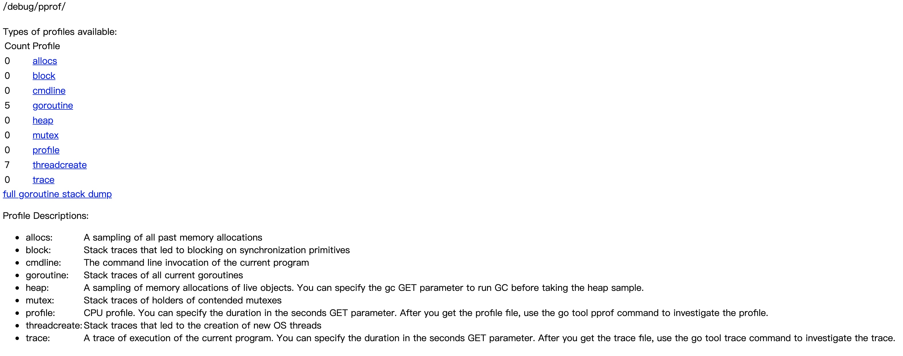

**使用场景：**
> 通过用于server服务、长时间运行的服务中，通过一个协成开启一个http性能监控服务，然后对服务的性能通过http接口分析

### 3.go test指定采样参数
> **通过golang单元测试go test编译执行时指定参数来生成采样数据文件(-memprofile memfilename生成内存采样文件、-cpuprofile cpufilename生成cpu采样文件、-blockprofile blockprofile生成阻塞采样文件...)**

**使用场景：**
> 主要用来分析基准测试时，程序执行的性能分析

**go test详细使用，参考另一篇文章[golang单元测试总结](https://github.com/jaydenwen123/technology_articles/blob/master/202006/golang%E5%8D%95%E5%85%83%E6%B5%8B%E8%AF%95%E6%80%BB%E7%BB%93.md)**

## 二、pprof性能监控分类
* allocs 程序运行过程中的内存分配采样
* block 追踪导致同步阻塞的栈
* cmdline 当前程序的命令行调用
* goroutine 当前所有goroutine的追踪栈 
* heap 存活对象额内存分配采样
* mutex 
* profile cpu性能分析文件，可以通过go tool pprof工具进行分析
* threadcreate 创建新的操作系统线程的栈追踪
* trace 当前执行程序路径
## 三、pprof性能监控具体参数含义

### go tool pprof各参数项的含义
```shell
(pprof) top
Showing nodes accounting for 12810ms, 56.46% of 22690ms total
Dropped 128 nodes (cum <= 113.45ms)
Showing top 10 nodes out of 102
      flat  flat%   sum%        cum   cum%
    2290ms 10.09% 10.09%     2560ms 11.28%  runtime.mapaccess1_fast64
    2160ms  9.52% 19.61%     5310ms 23.40%  runtime.scanobject
    1430ms  6.30% 25.91%     9530ms 42.00%  main.FindLoops
    1370ms  6.04% 31.95%     1370ms  6.04%  runtime.pthread_cond_wait
    1300ms  5.73% 37.68%     1300ms  5.73%  runtime.memmove
    1100ms  4.85% 42.53%     1310ms  5.77%  runtime.findObject
     990ms  4.36% 46.89%     2770ms 12.21%  main.DFS
     900ms  3.97% 50.86%     3780ms 16.66%  runtime.mallocgc
     660ms  2.91% 53.77%      660ms  2.91%  runtime.madvise
     610ms  2.69% 56.46%     2010ms  8.86%  runtime.mapassign_fast64ptr
```
* **flat:**采样时该函数运行的次数*采样时间(10ms),即可估算得到该函数的运行时间，该时间不包含等待子函数栈调用返回的时间
* **flat%：**运行时间/总的采样采样时间(total)，例如top1的flat%=2290/22690(%)
* **sum%:**sum计算的是topN的flat%总和，例如top2的sum%=10.09%+9.52%=19.61%
* **cum:**该时间指该函数出现在调用堆栈、包含等待子函数返回的时间，因此flat<=cum
* **cum%:**cum/total的所占的百分比

### go tool pprof重要指定介绍
1. **web：**通过web查看cpu、mem的详细信息
2. **list funcName：**查看funcName的具体代码cpu、mem占用信息
3. **pdf：**导出pdf文件
4. **top N:**展示cpu、mem占用topN的信息

### go tool pprof mem参数含义
1. --inuse_objects:正在使用的对象个数
2. --alloc_objects:分配的对象个数
3. --alloc_space:自程序启动以来分配了多少内存
4. go tool pprof -http=:xxxx mem.out 通过http服务查看详细信息，比较有用

## 四、pprof性能监控实例分析

> 在介绍CPU概要文件的生成方法之前，我们先来简单了解一下CPU主频。CPU的主频，即CPU内核工作的时钟频率（CPU Clock Speed）。CPU的主频的基本单位是赫兹（Hz），但更多的是以兆赫兹（MHz）或吉赫兹（GHz）为单位。时钟频率的倒数即为时钟周期。时钟周期的基本单位为秒（s），但更多的是以毫秒（ms）、微妙（us）或纳秒（ns）为单位。在一个时钟周期内，CPU执行一条运算指令。也就是说，在1000 Hz的CPU主频下，每1毫秒可以执行一条CPU运算指令。在1 MHz的CPU主频下，每1微妙可以执行一条CPU运算指令。而在1 GHz的CPU主频下，每1纳秒可以执行一条CPU运算指令

> 本文实例分析采用的项目为：[https://github.com/supcbs/go-pprof-operate.git ](https://github.com/supcbs/go-pprof-operate.git)


### heap分析

```shell
1.go tool pprof http://localhost:xxxx/debug/pprof/heap
2.top

```
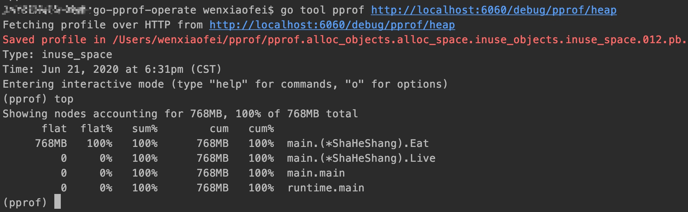

```shell
3.list funcXXX
```

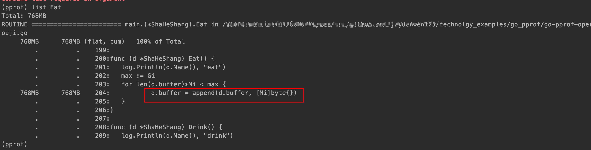

```shell
4.web
```
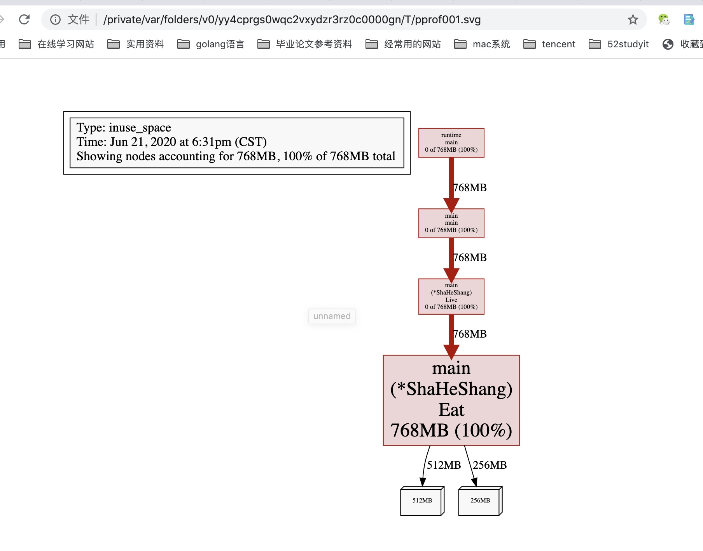

### cpu分析
```shell
1. go tool pprof http://localhost:xxxx/debug/pprof/profile

2. top 
```
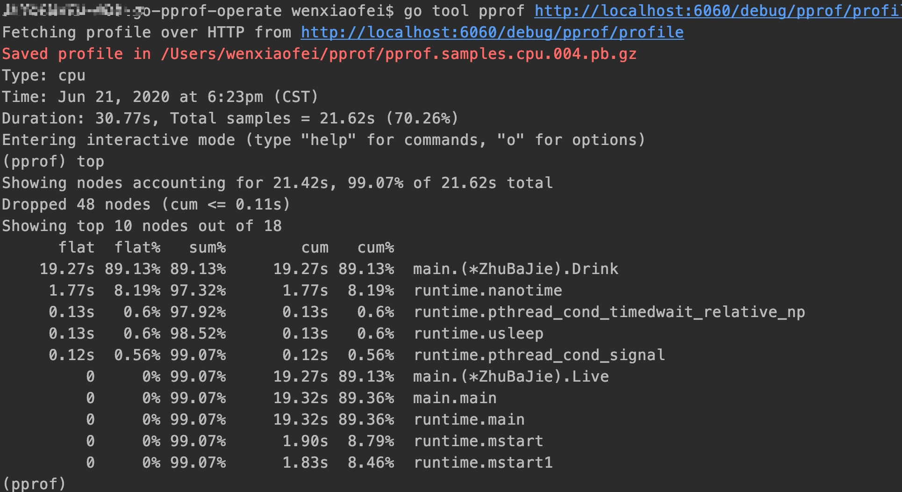

```shell
3.list funcXXX
```

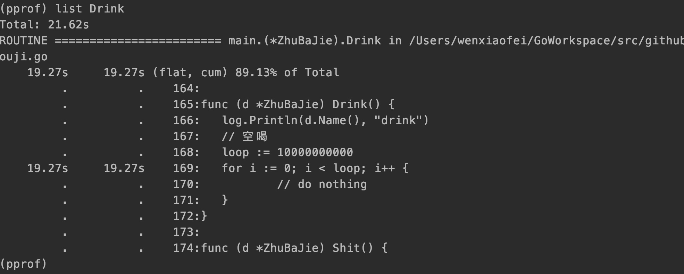

```shell 
4.web 
```
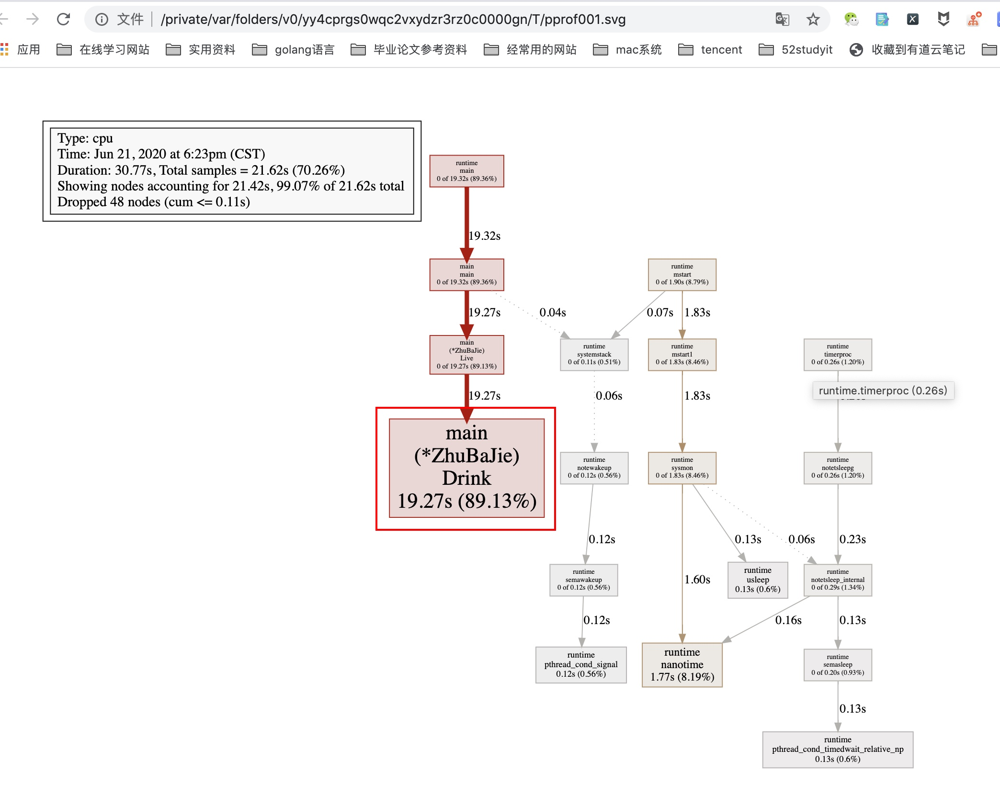


### allocs分析

```shell
0.GODEBUG=gctrace=1 ./xiyouji 2>&1|grep gc 查看gc垃圾回收信息

1.go tool pprof http://localhost:xxxx/debug/pprof/allocs

2.top 
```

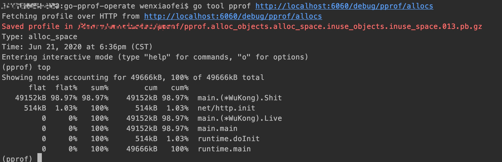

```shell
3.list funcXXX
```
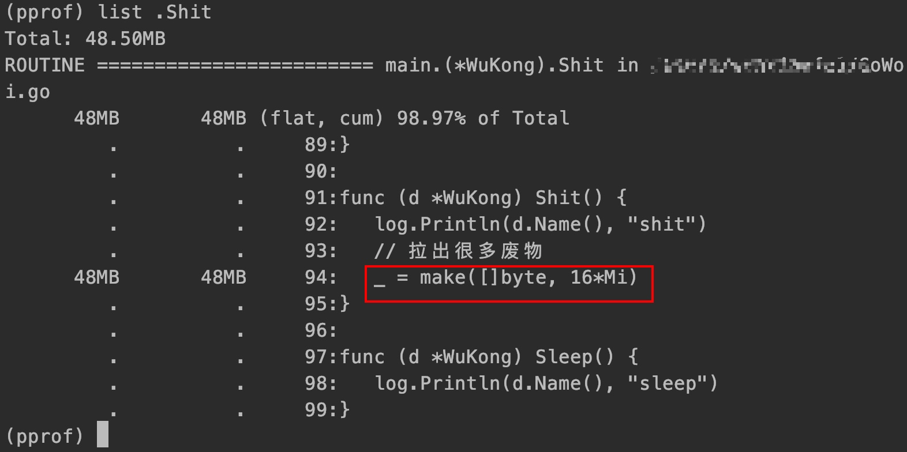

```shell
4.web
```
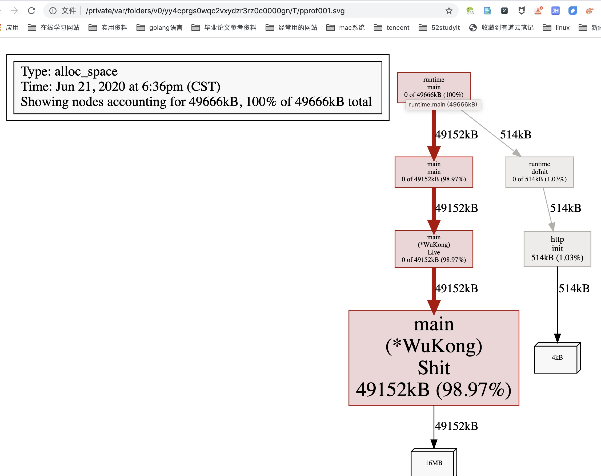

### goroutine分析

```shell
1.go tool pprof http://localhost:xxxx/debug/pprof/goroutine

2.top 
```
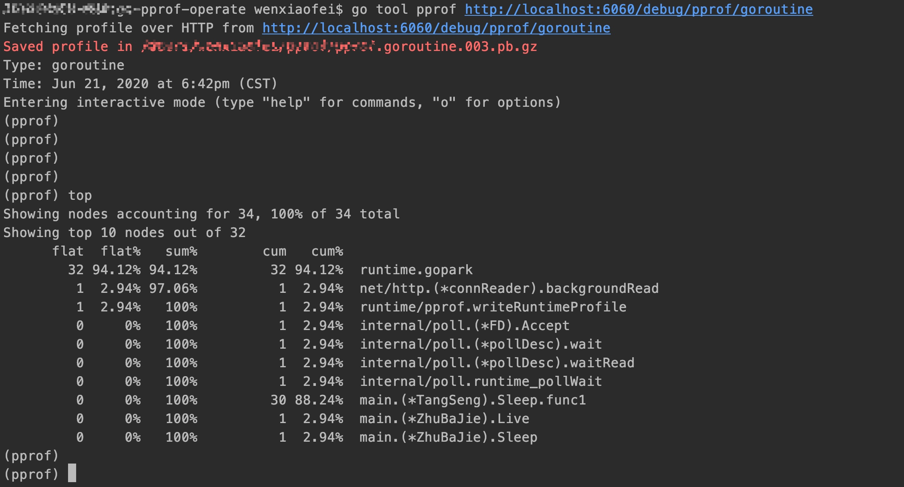

```shell
3.list funcXXX
```
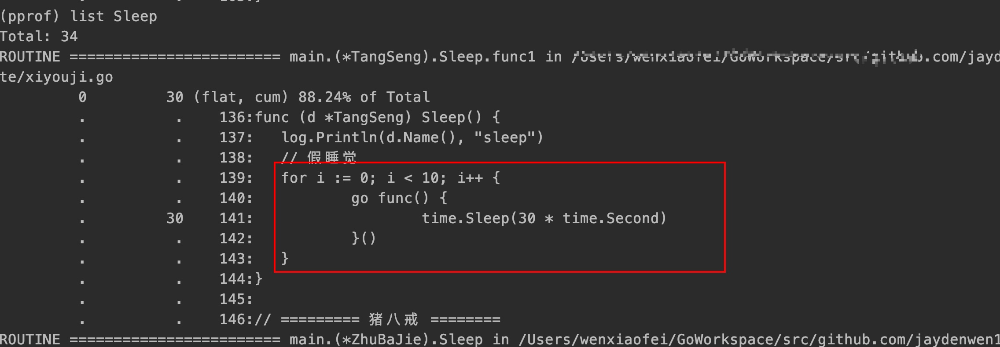

```shell
4.web
```
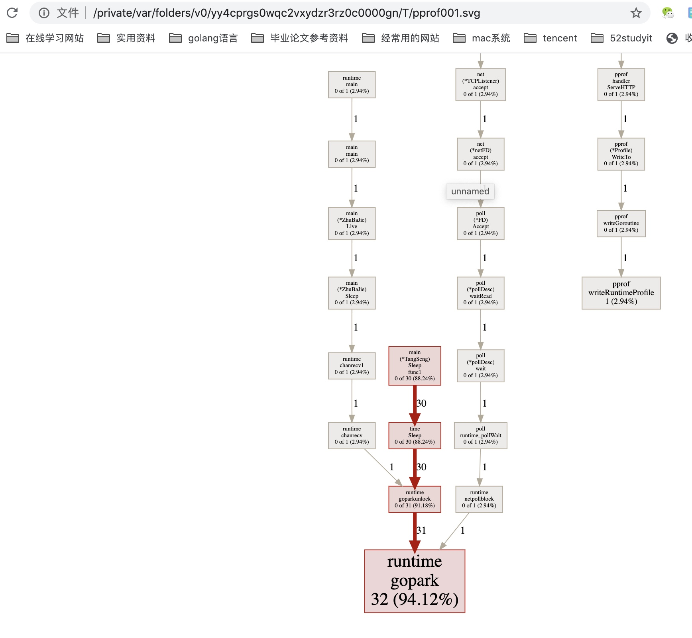

### block分析

```shell
1.go tool pprof http://localhost:xxxx/debug/pprof/block

2.top 
```
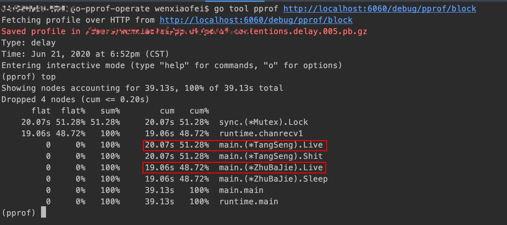

```shell
3.list funcXXX
```
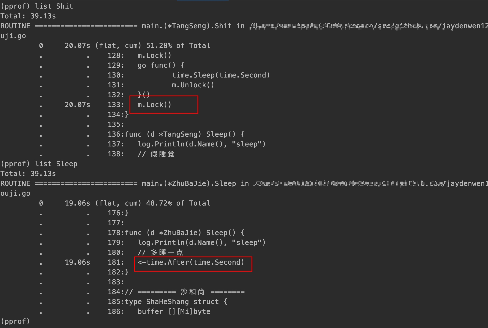

```shell
4.web
```
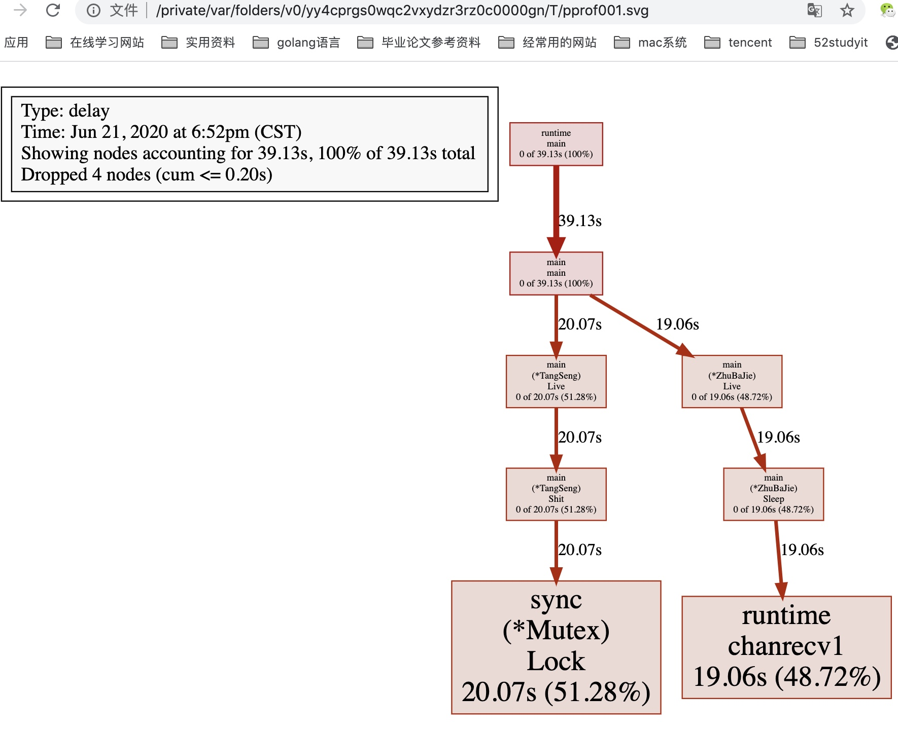

### mutex分析
```shell
go tool pprof http://localhost:xxxx/debug/pprof/mutex

top 

list funcXXX

web
```

### 火焰图查看
```shell
go tool pprof -http=:6060 cpu.out 即可查看
```
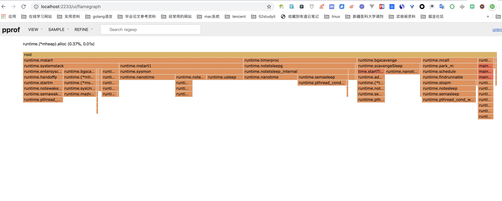

## 五、参考资料

1. [go pprof 性能分析](https://wudaijun.com/2018/04/go-pprof/)
2. [深度解密Go语言之pprof](https://juejin.im/post/5dca56ff518825575a358e9e)
3. [Go tool pprof性能监控调试工具基本使用说明](https://juejin.im/post/5ca85a126fb9a05e3c6991a9)
4. [一看就懂系列之Golang的pprof](https://juejin.im/post/5e5b6591518825492f771540)
5. [Go性能监控/分析工具：go tool pprof](https://johng.cn/go%e6%80%a7%e8%83%bd%e7%9b%91%e6%8e%a7%e5%88%86%e6%9e%90%e5%b7%a5%e5%85%b7%ef%bc%9ago-tool-pprof/)
6. [go标准命令详解0.12 go tool pprof](https://blog.csdn.net/u012210379/article/details/50443660)
7. [golang学习笔记-pprof性能分析1](https://blog.csdn.net/qq_30549833/article/details/89378933)
8. [golang学习笔记-pprof性能分析2](https://blog.csdn.net/qq_30549833/article/details/89381790)
9. [一看就懂系列之Golang的pprof](https://blog.csdn.net/u011957758/article/details/104612543)
10. [使用 pprof 和火焰图调试 golang 应用](https://blog.csdn.net/csCrazybing/article/details/78686941)
11. [轻松入门Golang pprof实用不忽悠](https://blog.csdn.net/m0_43499523/article/details/85849734)
12. [pprof (golang 性能监控与分析)](https://blog.csdn.net/sunxianghuang/article/details/93869683)