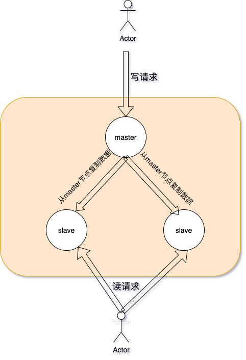
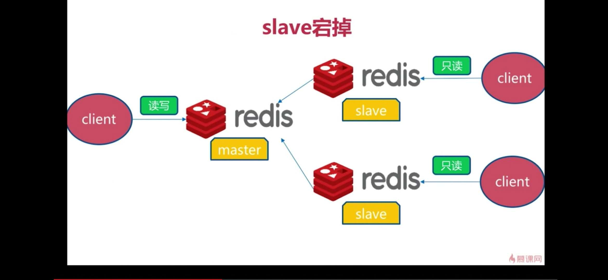
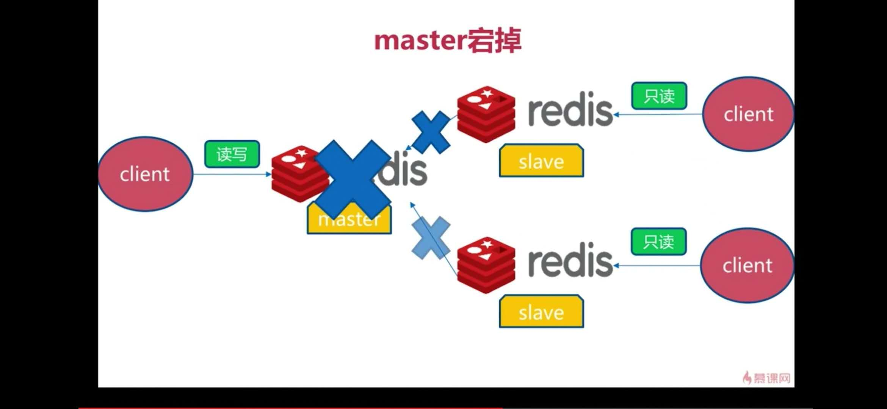
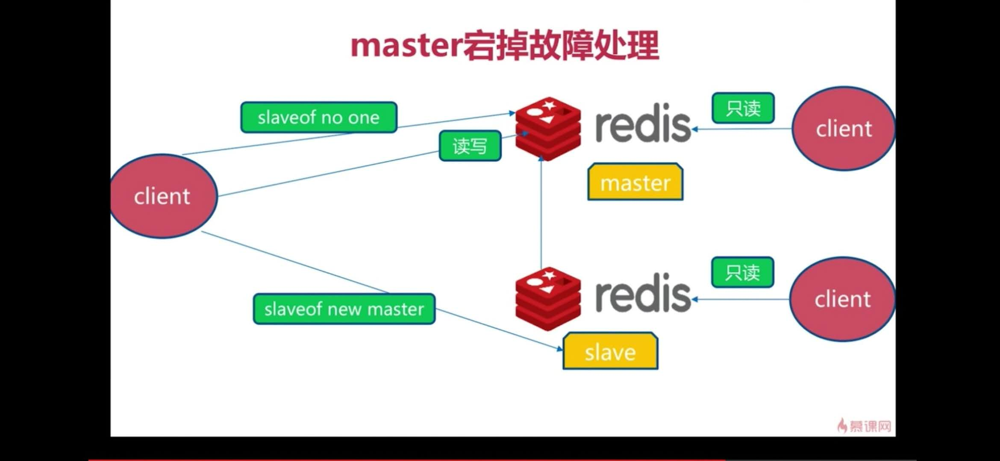

# redis 主从复制

## 1. 何为主从复制

在集群当中，通常为了提高**系统的可用性**，会采取一种主从的架构，主从架构又可以分为多主多从，和一主多从，在本文中，只以简单的一主多从结构来说明。

**主从复制：**在一主多从的架构中，一般选择一个主节点，称之为master节点，该节点处理用户的读写请求，其他的从节点称为slave节点，slave节点通过异步的方式从master节点复制数据到自身，起到一个备份的作用，当master节点宕机时，可以通过slave顶替master节点，实现一个**高可用**的效果。

除此之外，上述的架构中，明显有一些问题，例如，三个节点的组成一主两从的一个拓扑结构，但是对外只能有一个节点master对外提供访问，对于一般的组件如mysql等明显系统吞吐量太低，能处理的用户请求太少，因此又在主从复制的架构上衍生了**读写分离**的一种模式。

**读写分离：** 简单来说，就是让master节点负责其客户端的写操作，而slave节点负责客户端的读操作，对于大部分而言，都是一种读多写少的场景，因此通过读写分离的模式，可以大大提高资源的利用率和系统吞吐量。

下面是一主两从三个节点的一个拓扑结构

## 2. 为什么需要主从复制

**单节点的缺陷：** 我们知道，互联网应用中，如果采用单个节点处理用户请求，很容易出现单节点故障时，短期内无法给用户提供服务，造成不可挽回的损失，因此主从复制主要是为了改善这种问题，通过给单个节点拷贝多个副本，来实现备份。

**主从复制的本质：**
	是通过slave节点异步的复制master节点的数据，然后起到一个备份的作用，当master节点挂掉时，从节点可以快速顶替master节点，提高系统的可用性，例如mysql的主从复制、redis的主从复制，其本质都是提高系统的可用性。当然为了提高资源利用率，能接受短暂的数据不一致的系统又会采用**主从复制、读写分离**的模式来部署组件。

## 3. redis主从复制

**redis主从复制中，采用的方案是master节点处理读写请求，slave节点处理读请求**

### 3.1 下图为redis主从复制结构图

### 3.2 下图为master节点挂掉时场景

### 3.3 下图为故障转移处理

## 4. redis主从复制的优缺点

### 4.1优点

由于redis本身的一个高吞吐量，因此单机多节点通过主从复制部署时，已经可以处理很高的请求量了，同时slave节点能够很好的起到一个备份的作用，当master节点出问题时，成功顶替master节点，对外提供服务

### 4.2缺点

从redis的主从复制可以看出，当slave节点挂掉时，问题不大，系统仍然可以对外提供较好的服务，但是当master节点挂掉时，此时需要从slave节点中选择一个节点来顶替master节点，处理对外的读写请求。

**在redis的主从复制中，故障转移是需要告警、人工干预的。因此可以看出不利于系统的高可用和自动化运维。**

## 5. 故障自动转移

下一篇文章将重点介绍redis的主从复制下的高可用模式：**redis sentinel**，实现故障自动转移。
