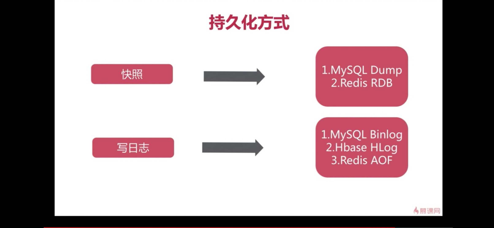
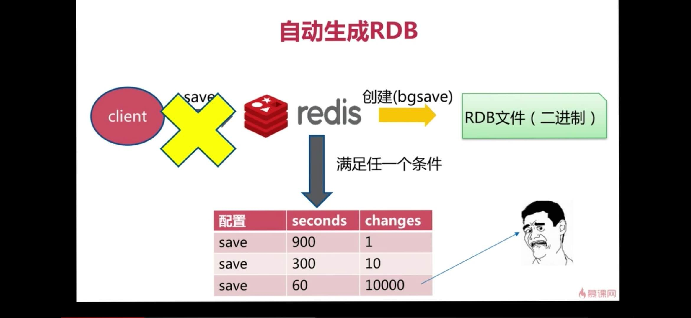
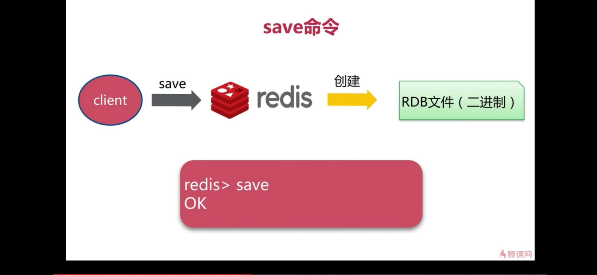
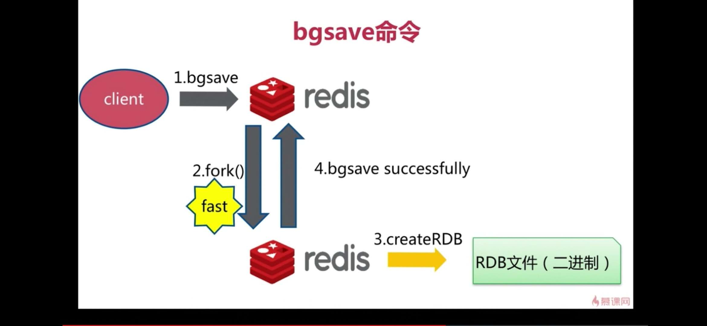
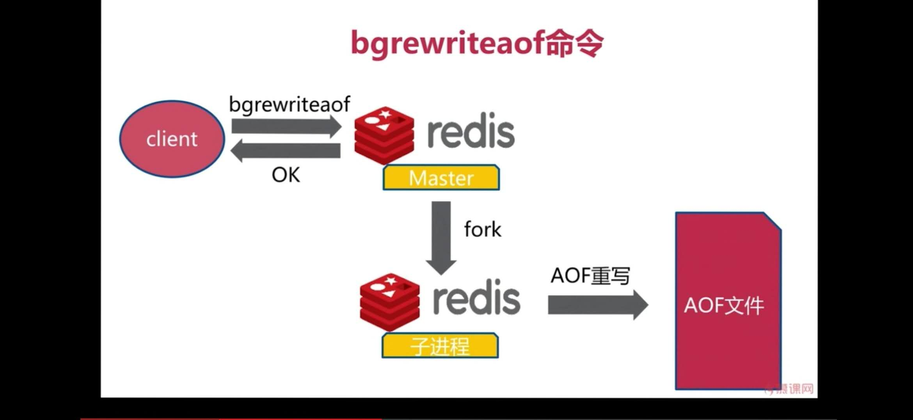
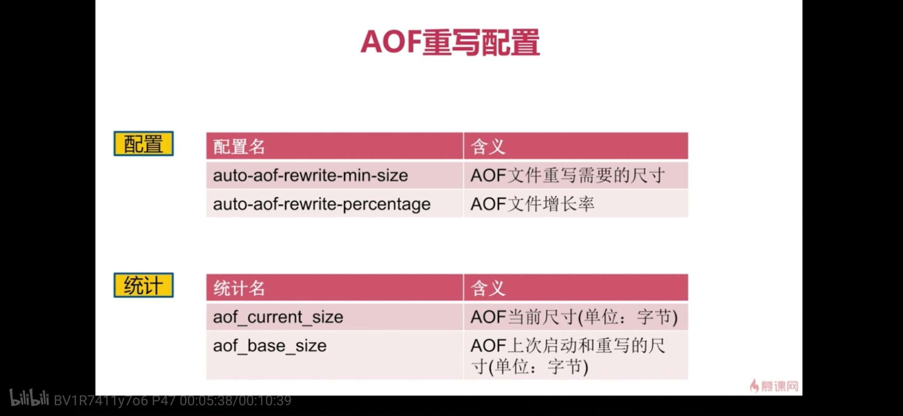
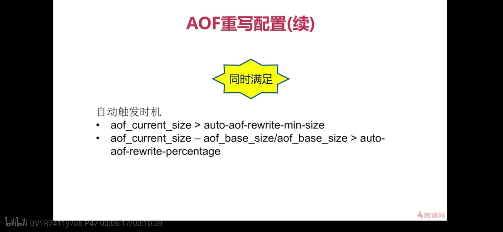

# redis持久化总结

俗话说，持久化persistence，指的是将一些数据通过一些介质存储，例如将内存中的数据保存到db或者保存成文件，即使机器进程挂掉了或者机器挂了，下次程序启动时可以将数据做一个load，还原到内存中。因此一般持久化用来导出、备份一些内存中的重要数据。redis的持久化是redis的一大特性，redis原生支持两种持久化方式，下文将逐一介绍。


## 1. redis持久化方式

### 1.1 redis持久化分类




### **1.2 rdb持久化** 

redis的rdb持久化，是一种快照式的持久化方式，简单可以理解成将内存中的数据的快照导出一份到文件，起到一个备份的作用。

### **1.3 aof持久化**

redis的aof持久化，是一种以追加log的方式来存储，每次进行数据的变更时，都先写一份数据到aof文件，程序如果挂掉了，重新启动时可以根据aof log文件中的记录逐一回复数据。


## 2. redis RDB持久化

### 2.1 什么是redis RDB

RDB：一种快照(snapshots)方式,redis提供的rdb以下几种方式会触发rdb持久化

1. 达到redis的配置文件中指定的条件
2. 在slave节点和master节点做数据同步时，全量数据会触发rdb
3. shutdown时，也会触发rdb持久化
4. debug reload




> 需要注意的是：rdb文件的策略是，每次替换旧的rdb文件

### 2.2 redis RDB 配置

```shell
# 每900s至少1个key发生了改变时触发
save 900 1
# 每300s至少10个key发生了改变时触发rdb
save 300 10
# 每60s至少10000个key发生了改变则触发rdb
save 60 10000
# 当bgsave error时停止写入
stop-writes-on-bgsave-error yes
# rdb是否压缩
rdbcompression yes
# rdb是否检查校验和
rdbchecksum yes
# rdb文件名
dbfilename dump-6379.rdb
```


### 2.3 redis RDB相关命令

```shell
# 同步命令
save

# 异步命令
bgsave

```

**save命令**



**bgsave命令**


**需要注意的是：redis的save命令会阻塞redis的当前进程，bgsave命令执行时会在后台fork()一个子进程进行处理生成rdb文件的操作**

## 3. redis  AOF持久化

### 3.1 什么是redis AOF

redis AOF（Append-Only File）持久化是一种日志记录的方式来做持久化，通常在执行任何更新命令时，都会先写日志，然后再执行操作。


### 3.2 redis AOF配置

```shell
# 是否开启aof
appendonly no
# aof文件名称
appendfilename "appendonly.aof"
# aof刷盘策略，everysec、always、no
appendfsync everysec
no-appendfsync-on-rewrite no
# aof重写百分比
auto-aof-rewrite-percentage 100
# aof重写的最小size
auto-aof-rewrite-min-size 64mb
aof-load-truncated yes
aof-use-rdb-preamble yes
```

### 3.3 redis AOF相关命令

```shell
# 异步执行
bgrewriteaof

```

### 3.4 redis AOF重写



**注意：由于aof文件每次都会记录日志，因此文件较大，因此redis的aof采用了aof重写的机制来优化aof文件的大小**


### 3.4 redis AOF三种策略

命令 | always | everysec | no
---|--- | --- | --- 
优点 | 不丢失数据 | 每秒一次fsync，丢1s的数据 | 不用管(操作系统决定)
缺点 | IO开销较大，一般的sata盘只有几百的TPS | 丢1s的数据 | 不可控(全权由操作系统决定)


## 4. redis RDB和AOF对比

命令 | RDB | AOF
--- | ---- | ---
启动优先级 | 低 | 高
体积| 小 | 大
恢复速度| 快| 慢
数据安全性| 丢数据| 根据策略决定(always不丢数据)
轻重| 重 | 轻


## 5. 参考资料
1. [持久化（persistence）](http://redisdoc.com/topic/persistence.html)
2. [Redis Persistence](https://redis.io/topics/persistence)
