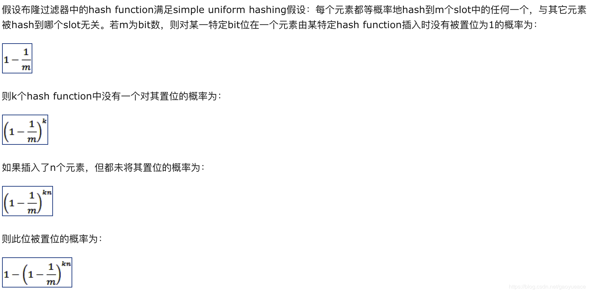
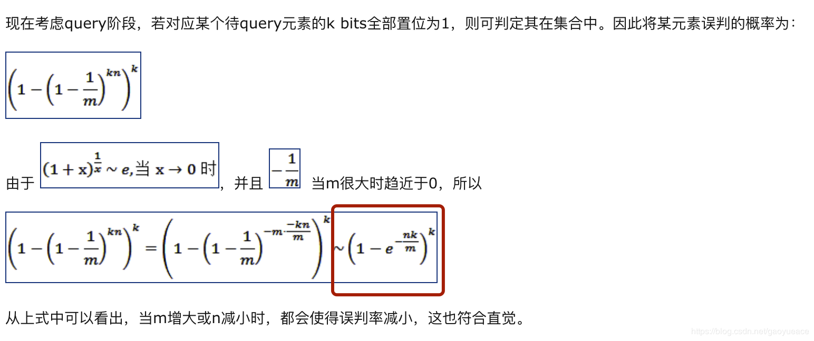
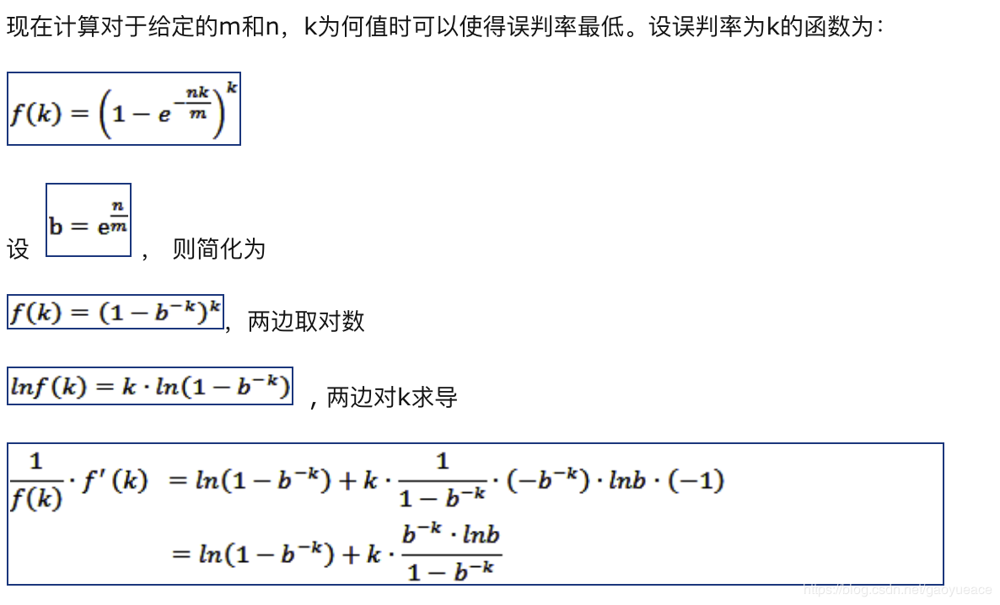
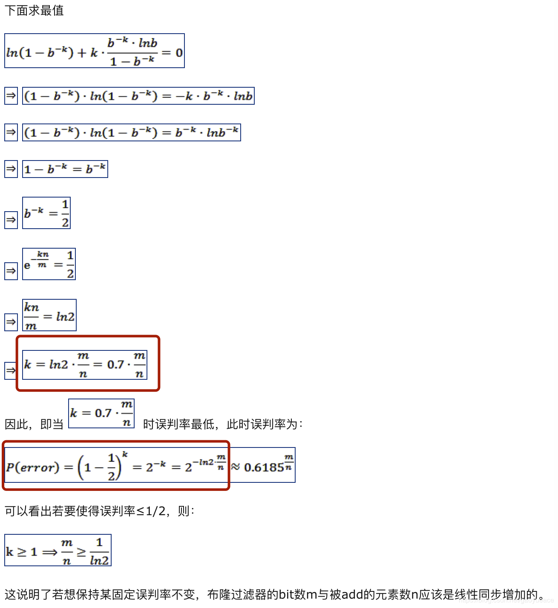
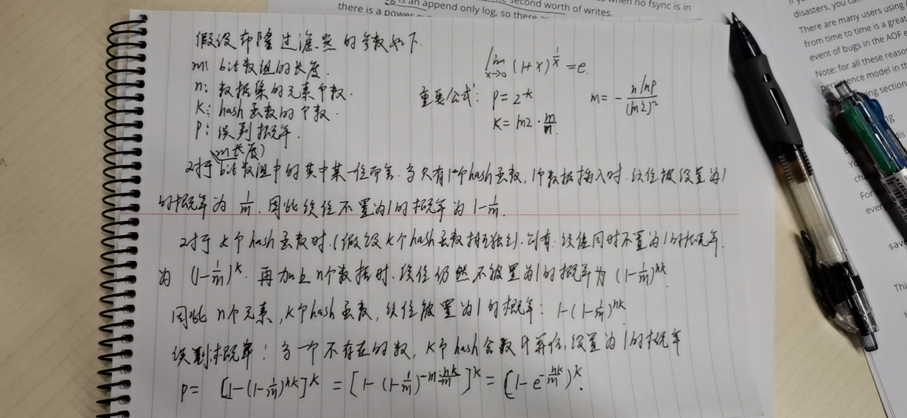
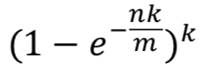

# 布隆过滤器原理

## 应用场景

通常，布隆过滤器用来解决检查部分数据是否出现在给定的数据集中的这类问题，实际生活的中应用场景有如下几个

1. 垃圾邮件的过滤
2. 秒杀系统限购下单检查
3. **推荐场景中的曝光去重**
4. 网页爬虫url去重
5. **数据库缓存穿透前（检查）**

## 原理介绍

布隆过滤器的本质个人理解其实是数据空间的转换，可以类比于以前高等数据中学的拉普拉斯变换和傅里叶变换记忆，但原理又不同。

布隆过滤器其本质都是通过将一类空间中的数据通过一种映射关系转变为另一个空间中的数据。举例来说，布隆过滤器将大量的数据集A(数据个数设定为n)通过k个hash函数映射到一个长度为m的bit数组上，通过k个hash函数对数据集中的每个数据计算出k个hash值，并将bit数组中对应的位置设置为1

当一个新元素过来时，依然通过k个hash函数来计算k个hash值 
 
* 如果上述k个hash值在bit数组中检查是否对应的位置都是1，**则说明该元素可能在数据集A中**  
* 如果有一个位置不为1，则说明**该元素肯定不在指定的数据集A中**

通过布隆过滤器的概念，可以知道，一个布隆过滤器通常由几个参数来指定，下面对齐参数进行说明

* **m：** bit数组长度，指当前布隆过滤器的bit数组的长度
* **n：** 初始化布隆过滤器的数据集元素个数
* **k：** 布隆过滤器指定的hash函数个数
* **p：** 布隆过滤器的误判率

对于上述几个参数，如果给定了m和n，则可以求解出误判率最低时的k

## 布隆过滤器特点

### **1. 布隆过滤器通常只能插入，不能删除**  

通常布隆过滤器设计为不能删除，只能插入的结构，因为如果对布隆过滤器支持删除的话，很容易引漏判的概率，例如假设一个布隆过滤器3个哈希函数，对于插入的x假设计算出的hash值为1，2，4。对于插入的y假设计算出的hash值为1，3，5。对于z假设hash值为1，2，3。此时如果删除z的话，会导致x和y在检查时都不存在，因此导致漏判。所以布隆过滤器不支持删除操作，虽然有布隆过滤器的改进版，但是删除操作时依然有部分未知的问题

### **2. 布隆过滤器存在误判的情况：**   
此处将举个简单例子来理解，假设3个hash函数，对于数据集中的x来说假设计算出来的hash值为1，2，4。对于y计算出来的hash值为2，3，6。我们假设此时对于z计算出来的hash置为1，3，6。那么此时如果插入了x和y，而接着判断z是否在改布隆过滤器中，明显看出会判断出z在当前的布隆过滤器中，原因是它被误判了，因为x和y正好计算出的hash值刚好覆盖了z的hash值，因为导致误判。


## 公式推导

在进行布隆过滤器公式推导前，首先介绍一个比较重要的数学公式：


``` math
 f(x)=(1+x)^1/x,当x趋向于0时的极限为e
```
后文将会用到该公式

如果想看电子版的公式推导，可以点击查看[该篇文章](https://blog.csdn.net/gaoyueace/article/details/90410735)

**测试搬运上文链接中的推导图片**






**布隆过滤器的公式推导如下：**




**重要公式**





## 参考资料

1. [布隆过滤器概念及其公式推导](https://blog.csdn.net/gaoyueace/article/details/90410735)
2. [布隆过滤器 (Bloom Filter) 详解](https://blog.csdn.net/houzuoxin/article/details/20907911)
3. [（1+1/n）\^n的极限为e，怎么求？](https://www.zhihu.com/question/66848041/answer/344136661)
