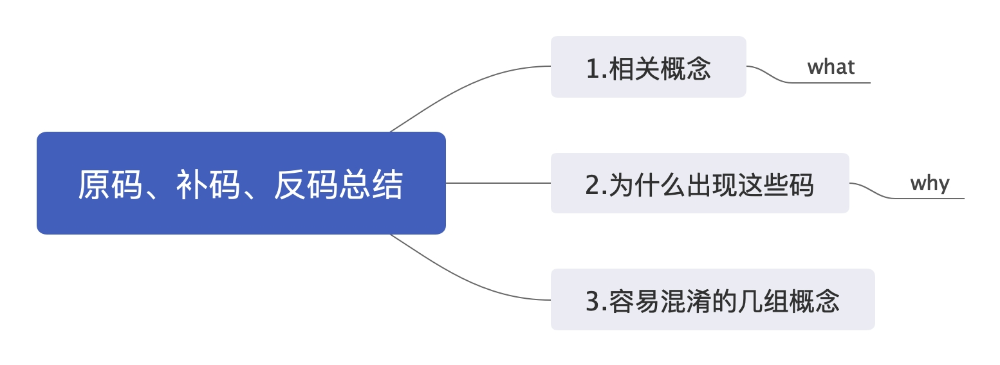

# 原码、反码、补码总结

> 昨天听同事聊起`取反`之类的操作，脑子里记忆不太清楚了，然后特意写篇文章用来总结

[toc]



## 一、原码、反码、补码、取反、按位取反

> 在计算机中，二进制数都是以**补码**的方式存放的

### 1.原码、反码、补码
**正数：**对正数而言，其**原码、补码、反码都是相同**，例如12，二进制表示为0000 1010，其原码、反码、补码都是1010  

**负数：**对负数而言，**补码=反码+1**，**反码=原码（除最高位符号位外）取反**

例如-12   

原码=1111 1010  (前面1111，表示符号位)
反码=1111 0101  
补码=1111 0110  
其-12在计算机中存储为1111 0110  

**反码：**正数的反码是其本身，对于负数其符号位不变其它各位取反(0变1,1变0)

> 负数的补码快速求解：**反码+1+原码(绝对值)=2^n**,因此**补码=反码+1=2^n - 原码(绝对值)**，例如-12的补码为2^4 - 12=4 ,所以表示为 1111 0110

### 2.取反
**取反：**0变1,1变0

### 3.按位取反

**按位取反：** 计算时，包含符号位一起取反，具体计算公式为：(~n)=-(n+1)

**举例:**

**举例1：**  

a=9，则其按位取反~a取反为-10
a的原码=0000 1001
a的反码=0000 1001
a的补码=0000 1001

~a之后的结果b=1111 0110 
然后该值存储在计算机中，即该值为补码，需要通过该值计算源码    
高位为1，即为负数    
b的补码=1111 0110  
b的反码=1111 0101（补码-1）  
b的源码=1111 1010 (除符号位依次取反) -10  

**举例2：**  
a=-10,则其按位取反为9  
a的原码：1111 1010  
a的反码：1111 0101  
a的补码：1111 0110   

b=~a=0000 1001 正数(补码)    
所以b的原码也是0000 1001 即为9

**结论：**

```
	1. 所有正整数的按位取反是其本身+1的负数，例如~9=-10
	2. 所有负整数的按位取反是其本身+1的绝对值 ~(-10)=9
	3. 零的按位取反是 -1（0在数学界既不是正数也不是负数）
```


## 二、为什么要出现补码、反码
根据冯~诺依曼提出的经典计算机体系结构框架。一台计算机由运算器，控制器，存储器，输入和输出设备组成。其中运算器，**只有加法运算器**，没有减法运算器（据说一开始是有的，后来由于减法器硬件开销太大，被废了 ）

所以，计算机中的没法直接做减法的，它的减法是通过加法来实现的。你也许会说，现实世界中所有的减法也可以当成加法的，减去一个数，可以看作加上这个数的相反数。当然没错，但是前提是要先有负数的概念。这就为什么不得不引入一个该死的符号位。

而且从硬件的角度上看，只有正数加负数才算减法。

正数与正数相加，负数与负数相加，其实都可以通过加法器直接相加。


**原码，反码，补码的产生过程，就是为了解决，计算机做减法和引入符号位（正号和负号）的问题。**


我们知道，**原码最大的问题就在于一个数加上他的相反数不等于零。**
例如：0001+1001=1010 (1+(-1)=-2) 0010+1010=1100 (2+(-2)=-4)
于是**反码的设计思想**就是冲着解决这一点，既然一个负数是一个正数的相反数，那我们干脆用一个正数按位取反来表示负数试试。

> 第一种计算方法：**计算机组成原理:**负数的补码等于他的原码自低位向高位，尾数的第一个‘1’及其右边的‘0’保持不变，左边的各位按位取反，符号位不变。  
> 第二种计算方法：补码：正数的补码等于他的原码,负数的补码等于反码+1。


## 三、参考资料

1. [原码，反码，补码的深入理解与原理](https://blog.csdn.net/afsvsv/article/details/94553228)
2. [按位取反运计算方法](https://blog.csdn.net/xiexievv/article/details/8124108?utm_medium=distribute.pc_relevant.none-task-blog-BlogCommendFromMachineLearnPai2-1.nonecase&depth_1-utm_source=distribute.pc_relevant.none-task-blog-BlogCommendFromMachineLearnPai2-1.nonecase)