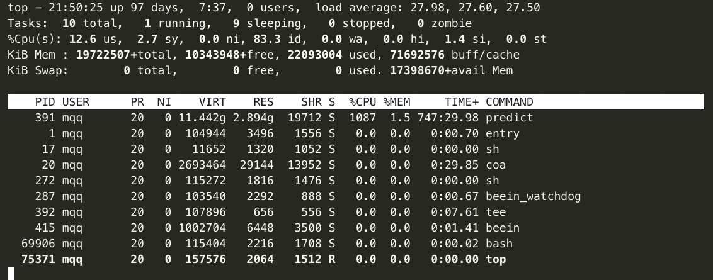
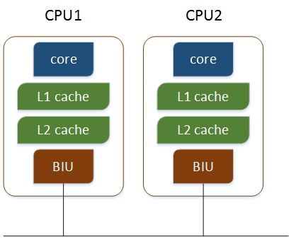
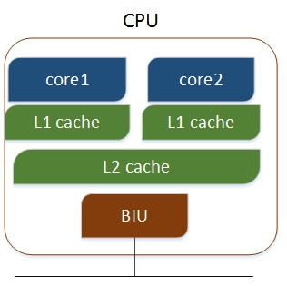
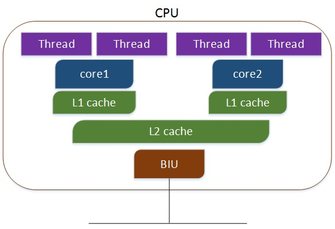

# 容易混淆的概念整理

## 1. KB和kbps、MB和Mbps的关系

**Mbps：** Milionbit per second (百万位每秒)  
**Kbps:** Kilobit  per second（千位每秒）  
**bps:** bit per second（位每秒）  
速度单位，bit即比特，用小写的b表示，指的是一位二进制位，1Mbps=1000Kbps=1000000bps,三者之间的关系是1000来转换

所以最终得出
**1Mbps=1000Kbps=1000000bps**
**1Kbps=1000bps**
Mbps、Kbps、bps通常是用来描述带宽的单位，指每秒钟传输的二进制位数


而通常在计算机中，显示速度则是每秒传输的字节数Byte，用B(大写的)表示。

**MB：**兆字节
**KB：**千字节
**B：**字节

上述三者之间的关系是 

**1MB=1024KB=1024\*1024B**

**1B=8bit=8b**

因此1M的带宽指：

1Mbps=1000Kbps=1000/8KBps=125KBps

所以1M的带宽，通常的卸载速度不会超过125KB每秒

**同理**

* 1M：125KBps 125k/s  
* 2M：250KBps 250k/s  
* 3M：375KBps 375k/s 
* 100M：12500KBps 12.5M/s 


此外：

1. **数据传输速率的衡量单位K是十进制的含义**
2. **数据存储的K是2进制的含义**
3. **数据传输速率的单位是bit/s 记作：bps**

1kbit/s:1000bit/s

数据存储(单位字节)
1KB=1024B


## 2. linux top命令详解

top命令在linux非常有用，可以说玩过linux的人，都对这个命令不陌生，本篇将对该命令的常用用法做一个梳理和总结。

### 2.1 使用

```shell
top
```


### 2.2 top的各个参数含义

#### 2.2.1 **第一行：**

**系统时间:** 21:50:25   
**运行时间:** 97days  
**当前登录用户:**  0 users  
**负载均衡(uptime) load average:**  27.98，27.60，27.50，上述值分别表示1分钟、5分钟、15分钟的负载情况。  

> load average数据时每隔5s钟然后检查一次活跃的进程数，然后按照特定的算法计算出的数值，如果这个数除以逻辑cpu的数量，结果高于5，就表示系统在超负荷运行了。


#### 2.2.2 **第二行：**

**Tasks:**   
**total:** 总进程数：10个   
**running:**运行中1个   
**sleeping:** 睡眠中9个   
**stopped:**停止0个  
**zombie:**僵尸进程0个

#### 2.2.3 第三行

**cpu：** cpu信息 

**us:** user space 用户空间占用cpu的百分比 (12.6)

**sy:** sysctl 内核空间占用cpu的百分比 (2.7)

**ni:** 改变过优先级的进程占用cpu的百分比 (0.0)


**id:** idle空闲cpu百分比 (83.3)

**wa:** wait IO等待占用cpu的百分比 (0.0)

**hi:** hardware interrupt硬件中断占用cpu的百分比 (0.0)

**si:** sortware interrupt软件中断占用cpu的百分比 (1.4)

**st:** 


#### 2.2.4 第四行

**Mem:** 内存信息

**total:** 总内存197G

**free:** 剩余内存103G

**used:** 使用内存22G

**buff/cache:** cache(缓存的内存量) 71G


#### 2.2.5 第五行
  
**Swap:** swap交换分区信息

**total:**总内存 0

**free:** 剩余内存 0 

**used:** 使用内存 0 

**avail mem:** 可用内存 173G

#### 2.2.6 top各字段介绍

PID | USER | PR | NI  | VIRT | RES | SHR | S | %CPU | %MEM | TIME+  | COMMAND |
----|---   |--- |---  |---   |---  |---  |---| ---  |---   | ---    | ---     |
进程id| 进程所有者 | 进程优先级priority | nice值，复制标识高优先级，正值表示低优先级，值越小优先级越高 | 进程使用的虚拟内存总量单位kb，VIRT=SWAP+RES |  进程使用的未被换出的物理内存大小，单位kb，RES=CODE+DATA| 共享内存(share)大小，单位kb| 进程状态，D=不可中断的睡眠状态，R=运行 S=睡眠 T=跟踪/停止，Z=僵尸进程| 上次更新到现在的cpu时间占用百分比|进程使用的物理内存百分比|进程使用的cpu时间总计，单位1/100s|进程名称(命令名、命令行)|

#### 2.2.7 详解几大内存

##### **1. VIRT**

**virtual memory usage:虚拟内存使用**  
1. 进程“需要的”虚拟内存大小，包括进程使用的库、代码、数据等  
2. 假设进程申请100M的内存、但是实际使用了10M，那么它会增长100M，虚拟内存显示的不是实际的使用量  

##### **2. RES**

**resident memory usage:常驻内存** 

1. 进程当前使用的内存大小，不包括swap out  
2. 包含其他进程的共享  
3. 如果申请100M的内存，实际使用了10M，则只会增长10M，和VIRT相反  
4. 关于库占用内存的情况，它只统计加载的库文件所占内存大小  

##### **3. SHR**

**shared memory:共享内存**

1. 除了自身的进程的共享内存，也包括其他进程的共享内存  
2. 虽然进程只使用了几个共享库的函数，但它包含了整个共享库的大小  
3. 计算某个进程所占用的物理内存：RES-SHR
4. swap out后，它会降下来  

##### **4. DATA**

1. 数据占用的内存。可以通过按下f键勾选显示
2. 真正该程序要求的数据空间，是真正在运行中要使用的


#### 2.2.8 常用命令

**l：**切换显示平均负载和启动时间信息。

**m:**切换显示内存信息。

**t:**切换显示进程和CPU状态信息。

**c:**切换显示命令名称和完整命令行。

**M:**根据驻留内存大小进行排序。

**P:**根据CPU使用百分比大小进行排序。

**T:**根据时间/累计时间进行排序。

**W:**将当前设置写入~/.toprc文件中。


## 3. linux查看物理cpu个数、核数、逻辑cpu个数

### 3.1 linux 物理cpu个数、核数、逻辑cpu个数

``` shell
1. 总核数=物理cpu个数 * 每颗物理cpu的核数
需要注意：如果每个物理cpu核数不同时，需要按照加法计算，例如一台机器总共有两个物理cpu，此时第一个cpu实际的逻辑核数为64，第二个cpu实际的逻辑核数为26，则此时总核数应为：64+26=90

2. 总逻辑cpu数=物理cpu数 * 每颗cpu的核数 * 超线程数

3. 查看物理cpu个数
cat /proc/cpuinfo |grep "physical id"|sort |uniq |wc -l
或者
cat /proc/cpuinfo |grep "physical id"|sort |uniq -c

 64 physical id     : 0
 26 physical id     : 1

因此只有2个物理cpu

4. 查看cpu的核数
cat /proc/cpuinfo |grep "cores"| uniq

cpu cores       : 32
cpu cores       : 13

5. 因此每个物理cpu的核数不同

6. 查看总的逻辑cpu数
cat /proc/cpuinfo |grep "processor"|wc -l

90
综上：可以得出，实际的总逻辑数=（32+13）* 2
超线程数：2，每个核有两个逻辑的处理单元，超线程出的两个核共享一个核的资源


7. 查询系统CPU是否启用超线程：cat /proc/cpuinfo | grep -e "cpu cores"  -e "siblings" | sort | uniq

输出举例：

cpu cores    : 6
siblings    　: 6


cpu cores       : 13
cpu cores       : 32
siblings        : 26
siblings        : 64

如果cpu cores数量和siblings数量一致，则没有启用超线程，否则超线程被启用。
```


**以下盗取几张描述cpu核和超线程技术的图，画的特别棒，图片来自[博客](https://www.cnblogs.com/hurry-up/p/9564064.html)**

**多个物理CPU，CPU通过总线进行通信，**效率比较低，如下： 



**多核CPU，不同的核通过L2 cache进行通信,**存储和外设通过总线与CPU通信，如下：



**多核超线程,每个核有两个逻辑的处理单元，**两个核共同分享一个核的资源，如下：




### 3.2 cpuinfo参数介绍

```shell
cat /proc/cpuinfo |head -80

processor       : 0  系统中逻辑处理核的编号。对于单核处理器可以认为等于cpu编号，对于多核处理器则表示物理核或者使用超线程技术虚拟出来的逻辑核编号，本文中的含义属于后者
vendor_id       : AuthenticAMD   cpu制造商
cpu family      : 23   cpu产品系列代号
model           : 49   cpu属于其系列中的哪一代的代号
model name      : AMD EPYC 7K62 48-Core Processor  cpu所属于的名字以及编号、标称主频
stepping        : 0  cpu属于的制作更新版本
microcode       : 0x1000065  
cpu MHz         : 2595.124  cpu的实际使用主频
cache size      : 512 KB  cpu二级缓存大小
physical id     : 0   单个cpu的编号
siblings        : 64  单个cpu逻辑物理核数（单个物理cpu的总逻辑核数，包括cpu核数、超线程虚拟出来的综合）
core id         : 0  当前物理核再其所处的cpu编号，不一定连续
cpu cores       : 32  该逻辑核所处的cpu的物理核数
apicid          : 0  用来区分不同逻辑核的编号，系统中每个逻辑核编号肯定不同，此编号不一定连续
initial apicid  : 0 
fpu             : yes  floating point unit 是否具有浮点运算单元
fpu_exception   : yes  是否支持浮点运算异常
cpuid level     : 13  执行cpuid指令前，eax寄存器中的值，根据不同的值cpuid指令会返回不同的内容
wp              : yes 表明当前CPU是否在内核态支持对用户空间的写保护（Write Protection）
flags           : fpu vme de pse tsc msr pae mce cx8 apic sep mtrr pge mca cmov pat pse36 clflush mmx fxsr sse sse2 ht syscall nx mmxext fxsr_opt pdpe1gb rdtscp lm rep_good nopl extd_apicid amd_dcm eagerfpu pni pclmulqdq ssse3 fma cx16 sse4_1 sse4_2 x2apic movbe popcnt aes xsave avx f16c rdrand hypervisor lahf_lm cmp_legacy cr8_legacy abm sse4a misalignsse 3dnowprefetch osvw topoext vmmcall fsgsbase bmi1 avx2 smep bmi2 rdseed adx smap clflushopt sha_ni xsaveopt xsavec xgetbv1 arat  当前CPU支持的功能
bogomips        : 5190.24  在系统内核启动时粗略测算的CPU速度（Million Instructions Per Second）
TLB size        : 1024 4K pages 
clflush size    : 64  每次刷新缓存的大小单位
cache_alignment : 64  缓存地址对齐单位
address sizes   : 48 bits physical, 48 bits virtual 可以访问的地址空间位数
power management:

processor       : 1
vendor_id       : AuthenticAMD
cpu family      : 23
model           : 49
model name      : AMD EPYC 7K62 48-Core Processor
stepping        : 0
microcode       : 0x1000065
cpu MHz         : 2595.124
cache size      : 512 KB
physical id     : 0
siblings        : 64
core id         : 0
cpu cores       : 32
apicid          : 1
initial apicid  : 1
fpu             : yes
fpu_exception   : yes
cpuid level     : 13
wp              : yes
flags           : fpu vme de pse tsc msr pae mce cx8 apic sep mtrr pge mca cmov pat pse36 clflush mmx fxsr sse sse2 ht syscall nx mmxext fxsr_opt pdpe1gb rdtscp lm rep_good nopl extd_apicid amd_dcm eagerfpu pni pclmulqdq ssse3 fma cx16 sse4_1 sse4_2 x2apic movbe popcnt aes xsave avx f16c rdrand hypervisor lahf_lm cmp_legacy cr8_legacy abm sse4a misalignsse 3dnowprefetch osvw topoext vmmcall fsgsbase bmi1 avx2 smep bmi2 rdseed adx smap clflushopt sha_ni xsaveopt xsavec xgetbv1 arat
bogomips        : 5190.24
TLB size        : 1024 4K pages
clflush size    : 64
cache_alignment : 64
address sizes   : 48 bits physical, 48 bits virtual
power management:
```

## 4.参考资料

1. [linux 查看机器cpu核数](https://www.cnblogs.com/hurry-up/p/9564064.html)
2. [/proc/cpuinfo 文件分析(查看CPU信息)](https://blog.csdn.net/cuker919/article/details/7635488)
3. [Linux top命令详解](https://www.cnblogs.com/niuben/p/12017242.html)
