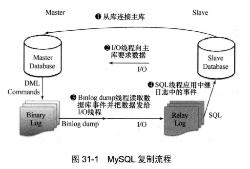
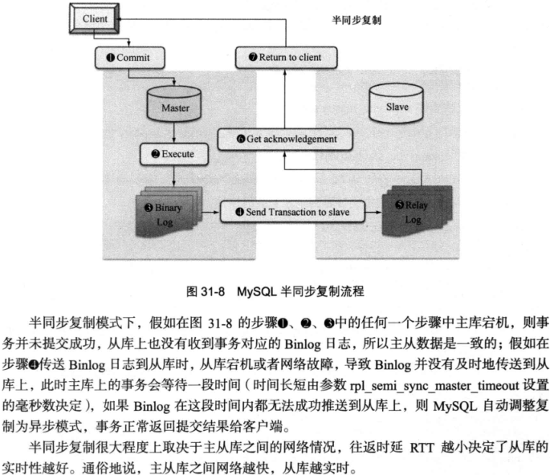
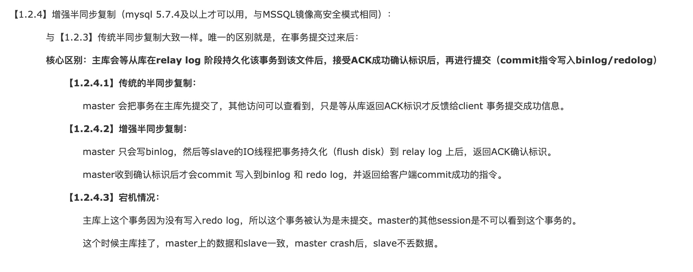
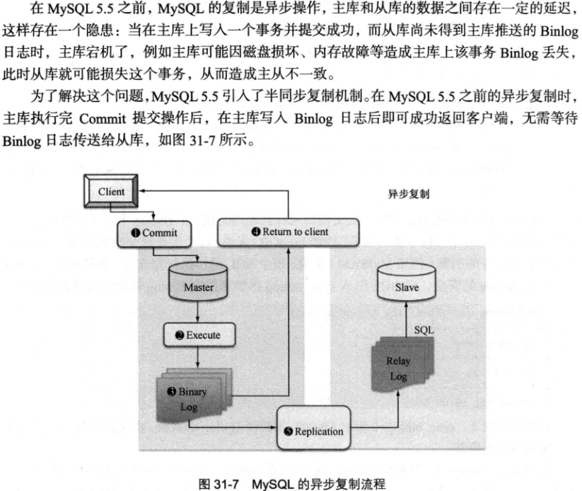
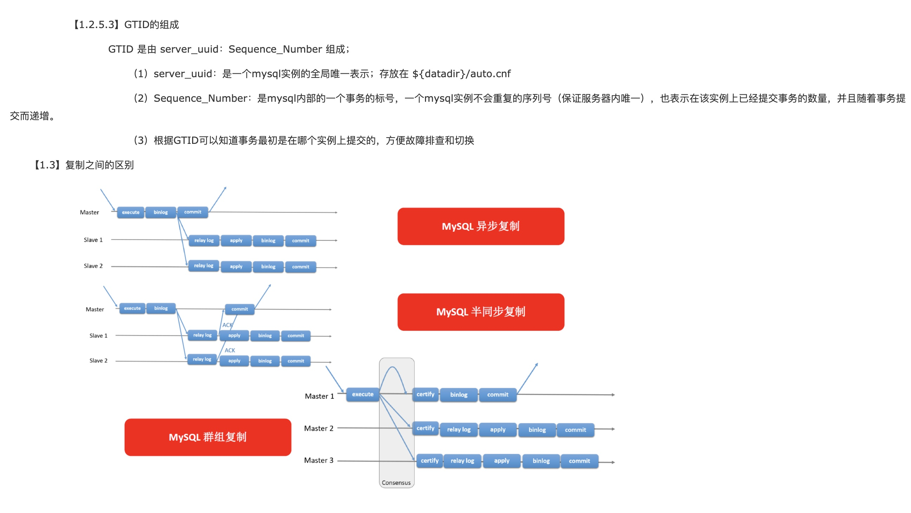

# mysql 主从架构总结

> 对于一个分布式系统而言，系统的可用性至关重要，通常在互联网公司里，都要求线上服务至少保证4个9的可用性，即失败率0.0001%。下文将重点介绍分布式系统中，PA系列的mysql分布式组件(Partition&Available)如何保证高可用。

## 1. mysql的高可用主从架构

目前主流的mysql高可用架构主要有以下几类

* 一主一从
* 一主多从
* 双主架构
* 多主一从架构(用来备份数据库数据到从数据库)
* 级联结构
* MGR（mysql group replication）
* MMM (multi master manager )
* MHA（master high available）

**mysql高可用架构**|一主一从 | 一主多从 | 双主| 多主一从|级联架构|MMM架构|MHA架构|MGR架构
---|---|---|---|---|---|---|---|---
**拓扑图** | | | | ||||
**优点** | 部署比较简单，主挂掉后，故障迁移比较简单 | 架构比较简单，可以实现水平扩展，读写分离，提高系统的读性能| 两方互为master和slave，一方的数据任意变更，可以同步到领一台节点| 多主一从架构主要用于数据库备份的场景，通常slave节点的机器配置会好比较好|当slave节点过多时，可能会对master节点产生一定的影响，因此，将slave节点进行分级，将部分二级slave节点挂到一级slave节点上面，以便减轻对主master节点的影响|同一时间只有一个master对外提供服务，另一个master相当于是备机，该方案可以使得读写的均高可用|master故障时通过提升一个slave节点成为新的master以保证可用性，该模式既支持日志点的复制，也支持GTID的复制|mgr是通过paxos算法保证数据一致性，支持多主写入。数据强一致，不丢事务。数据延时很小
**缺点** | 系统具备可用性，但仍然可用性不高 | 当从节点过多时，主从之间的数据同步可能会影响主节点的性能| 两台机器都可以处理写请求，一定程度可以提高写的性能 | -| 二级的slave节点数据会和master节点相差较大，如果处理线上读请求可能导致数据不一致|故障的转移简单粗暴，容易丢失事务数据，为降低丢数据的概率，通常采用msyql的半同步复制，该方案不支持GTID的复制|mha只监控master状态，不监控slave状态。其次脚本需要自行开发|只支持innodb，只能用GTID复制，并且只支持row的binlog格式

## 2. mysql主从同步

> 该部分引用的图片均来自[这篇文章](https://www.cnblogs.com/gered/p/11221702.html#_label1)，作者总结的很好，此处主要是方便自己理解+加深记忆，因此才写下这篇文章

### 2.1 mysql主从同步协议(同步数据格式)

**mysql中主从同步的数据格式为bin log文件**，下面将分别介绍mysql中的bin log文件格式

**1. SBR(Statement-Based-Replication):基于sql的数据复制**  

该格式在5.5.6之前是默认格式，主服务器执行的sql语句，dump后在从服务器执行同样的sql语句

**1. RBR(Row-Based-Replication):基于行的数据复制**  

该格式在5.5.7之后为默认的bin log格式，主要把改变的内容从主库dump，然后复制到从库，而不是sql命令在从库重新执行一遍，该格式在mysql5.0就开始支持

**1. MBR(Mixed-Based-Replication):基于混合方式的数据复制** 

该格式是指：将SBR和RBR两种格式混合起来，默认采用sql语句的复制，当出现sql语句无法精确复制（例如sql语句中含有now()等）时，由于主库和从库有延迟，因此转换为基于行的复制 

### 2.2 mysql主从同步的原理

**mysql的主从同步主要有三个线程(1个master线程、2个slave线程)**  
一个master线程（dump bin log thread）  
一个slave线程（io thread）发起请求给master，并处理回包，将bin log记录到relay log中  
另一个slave线程（sql thread）用来将relay log 中的数据应用到db中  

### 2.3 mysql主从同步的方式

**1.全同步策略**

  
**2.半同步策略**  

**3.增强半同步策略**  

**4.异步策略**  

**5.TGID复制**

#### 2.1.1 全同步策略

一句话总结全同步：当一个请求到达mysql master主库时，主库需要复制bin log等待所有slave节点执行完**(执行完事务，并提交后)并响应后，主库才能提交事务**，最后回复客户端，属于强一致性，但系统的性能很低，基本上线上环境不会采用这种策略。

**全同步和半同步的区别：**全同步需要从库sql线程完整执行完该事务，才能响应主库，而半同步则是从库只需要将主库的binlog数据保存到relaylog中即可回应主库

> 原理：主库事务写入redo log和 binlog 文件后，binlog dump线程提取binlog数据给IO线程，IO线程把数据加载回从库的relay log文件。
从库SQL线程开启事务重做应用relay log数据操作，等从库提交完后，返回ACK确认标识，主库才会提交

#### 2.1.2 半同步策略

一句话总结半同步：当一个请求达到mysql主库时，主库将其应用到自己的同时并导出binlog，然后复制binlog给slave节点，只需等待一个slave节点**将主库的binlog记录到relaylog中并flash 磁盘落地即可**回应master，master接收到slave的响应后就可以返回给客户端

**备注：****这里在主库同步给从库时，主库已经执行了commit操作，在提交后才同步给从库，需要和全同步复制区别开来。**

> 这里的commit主库上是已经在 binlog、redo log 中提交了的，其他session都可以看到。但需要等待从库返回ACK确认标识才会把事务提交到存储引擎持久化（即 ibdata、ibd等磁盘数据文件）且返回到client一个commit成功的指令
> 
> **master宕机：**master上这个事务其实是已经提交了并且落盘master的binlog了，master的其他Session是可以看到这个提交后的事务的，而slave还没有commit。
这个时候master挂了，master上的数据和slave不一致。master crash后，master根据redo重做提交了这个事务.在切换到从后，slave因为没有commit而回滚了这个事务导致数据丢失。导致主从不一致。

#### 2.1.3 增强半同步策略

一句话总结增强版同步：在传统半同步复制中，master节点先将事务执行，然后commit后，将binlog同步给slave节点，slave节点接收到数据后，记录在relaylog中，然后就会回复master节点，近而master接收响应后，回复客户端。而**增强半同步复制指，将commit的操作放在slave节点回复master之后再去做，此时能够保证两节点的数据一致**

#### 2.1.4 异步策略

一句话总结异步：异步复制顾名思义是当主库收到一个请求进来时，只需要自己处理应用，处理完成后即可返回给客户端，主库和从库的数据复制通过异步方式传递，该种方式可能会丢数据。例如当主库自己写数据成功，然后返回给客户端成功后，但是还没有将数据同步给slave节点，此时故障转移时将slave提升为新的master，就会导致数据不一致。

#### 2.1.5 GTID复制

## 3. mysql主从切换

master挂掉时，如何选择slave节点称为新的master，选取数据最新的slave

待补充

## 4. mysql数据延迟

待补充

## 5. 实战mysql主从架构

待补充

## 6. 参考资料

1. [Mysql Replication 简明教程](https://zhuanlan.zhihu.com/p/67325171)  
1. [深度探索MySQL主从复制原理](https://zhuanlan.zhihu.com/p/50597960)  
1. [小白都能懂的Mysql主从复制原理（原理+实操）](https://zhuanlan.zhihu.com/p/164518315)  
1. [里奥ii：MySQL 三万字精华总结 + 面试100 问，和面试官扯皮绰绰有余（收藏系列）](https://zhuanlan.zhihu.com/p/164519371)  
1. [把MySQL中的各种锁及其原理都画出来](https://zhuanlan.zhihu.com/p/149228460)    
1. [关于Kafka知识看这一篇就够了，Apache Kafka互联网实战整理PDF](https://zhuanlan.zhihu.com/p/151034757) 
2. [（5.1）mysql高可用系列——高可用架构方案概述](https://www.cnblogs.com/gered/p/11221702.html#_label0)
3. [MySQL高可用架构对比，MMM与MHA以及MGR](https://blog.csdn.net/William0318/article/details/106855431)
4. [【MySQL】MMM和MHA高可用架构](https://www.cnblogs.com/wwcom123/p/10891794.html)   
  

