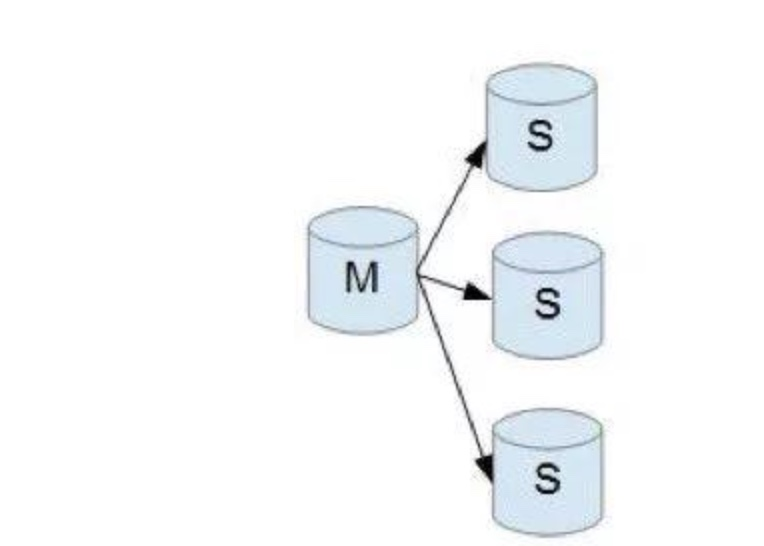
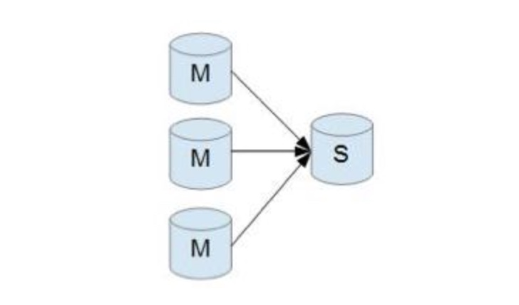
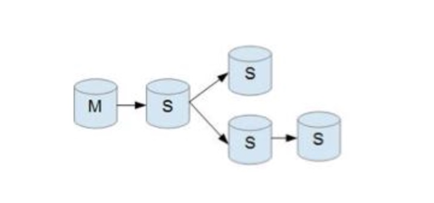
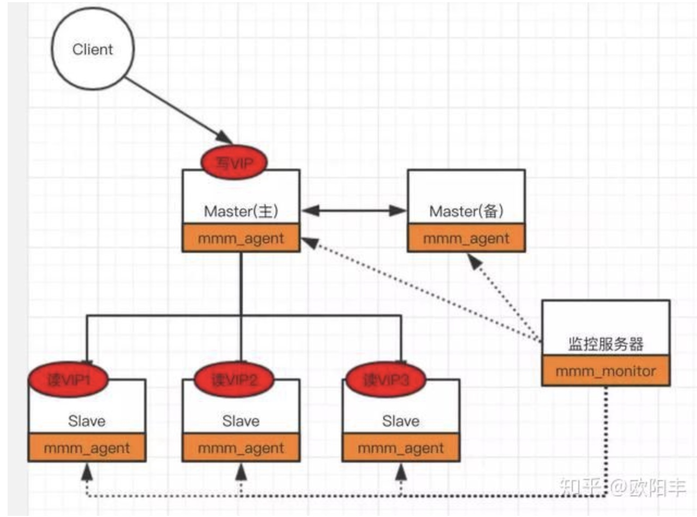
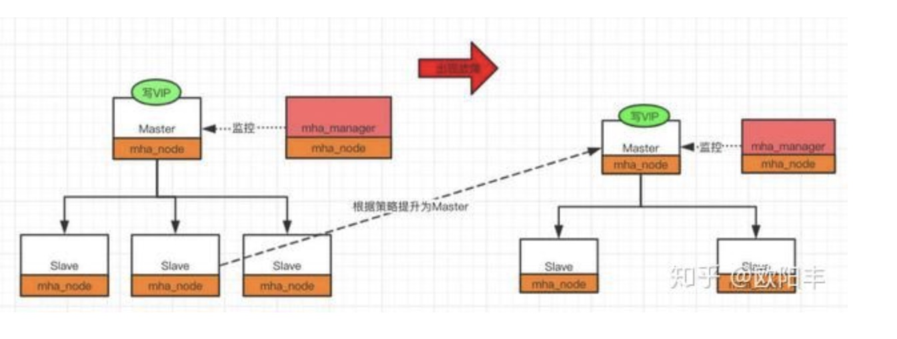
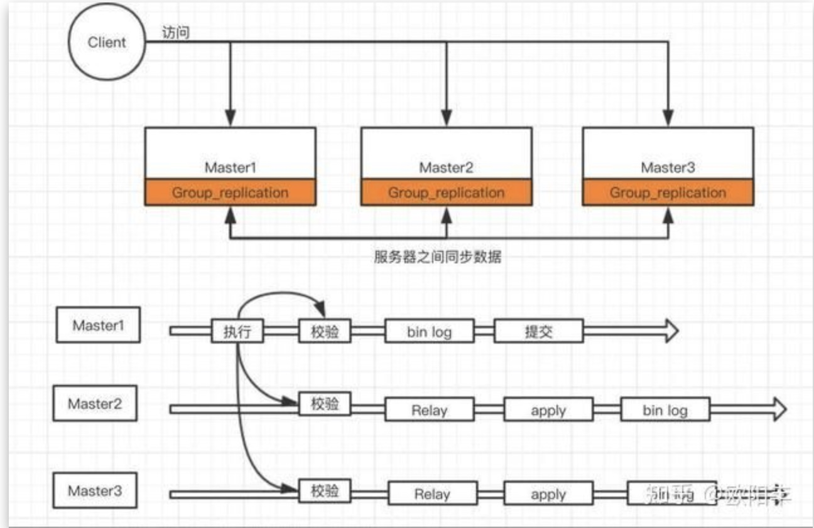

# mysql 主从架构总结

> 对于一个分布式系统而言，系统的可用性至关重要，通常在互联网公司里，都要求线上服务至少保证4个9的可用性，即失败率0.0001%。下文将重点介绍分布式系统中，PA系列的mysql分布式组件(Partition&Available)如何保证高可用。

## 1. mysql的高可用主从架构

目前主流的mysql高可用架构主要有以下几类

* 一主一从
* 一主多从
* 双主架构
* 多主一从架构(用来备份数据库数据到从数据库)
* 级联结构
* MGR（mysql group replication）
* MMM (multi master manager )
* MHA（master high available）

**mysql高可用架构**|一主一从 | 一主多从 | 双主| 多主一从|级联架构|MMM架构|MHA架构|MGR架构
---|---|---|---|---|---|---|---|---
**拓扑图** | | | | ||||
**优点** | 部署比较简单，主挂掉后，故障迁移比较简单 | 架构比较简单，可以实现水平扩展，读写分离，提高系统的读性能| 两方互为master和slave，一方的数据任意变更，可以同步到领一台节点| 多主一从架构主要用于数据库备份的场景，通常slave节点的机器配置会好比较好|当slave节点过多时，可能会对master节点产生一定的影响，因此，将slave节点进行分级，将部分二级slave节点挂到一级slave节点上面，以便减轻对主master节点的影响
**缺点** | 系统具备可用性，但仍然可用性不高 | 当从节点过多时，主从之间的数据同步可能会影响主节点的性能| 两台机器都可以处理写请求，一定程度可以提高写的性能 | -| 二级的slave节点数据会和master节点相差较大，如果处理线上读请求可能导致数据不一致

## 2. mysql主从同步

### 2.1 mysql主从同步的方式

**1.全同步策略**  
**2.半同步策略**  
**3.增强半同步策略**  
**4.异步策略**  

#### 2.1.1 全同步策略

#### 2.1.2 半同步策略

#### 2.1.3 增强半同步策略

#### 2.1.4 异步策略

#### 2.1.5 同步策略对比

### 2.2 mysql主从同步协议(同步数据格式)

1.bin log

SBR(Statement-Based-Replication):基于sql的数据复制
RBR(Row-Based-Replication):基于行的数据复制
MBR(Mixed-Based-Replication):基于混合方式的数据复制

### 2.3 mysql主从同步的原理

1.三个线程
一个master线程（dump bin log thread）
一个slave线程（io thread）发起请求给master，并处理回包，将bin log记录到relay log中
另一个slave线程（sql thread）用来将relay log 中的数据应用到db中

## 3. mysql主从切换

master挂掉时，如何选择slave节点称为新的master

## 4. mysql数据延迟

## 5. 实战mysql主从架构

## 6. 参考资料

1. [Mysql Replication 简明教程](https://zhuanlan.zhihu.com/p/67325171)  
1. [深度探索MySQL主从复制原理](https://zhuanlan.zhihu.com/p/50597960)  
1. [小白都能懂的Mysql主从复制原理（原理+实操）](https://zhuanlan.zhihu.com/p/164518315)  
1. [里奥ii：MySQL 三万字精华总结 + 面试100 问，和面试官扯皮绰绰有余（收藏系列）](https://zhuanlan.zhihu.com/p/164519371)  
1. [把MySQL中的各种锁及其原理都画出来](https://zhuanlan.zhihu.com/p/149228460)    
1. [关于Kafka知识看这一篇就够了，Apache Kafka互联网实战整理PDF](https://zhuanlan.zhihu.com/p/151034757) 
2. [（5.1）mysql高可用系列——高可用架构方案概述](https://www.cnblogs.com/gered/p/11221702.html#_label0)   
  

