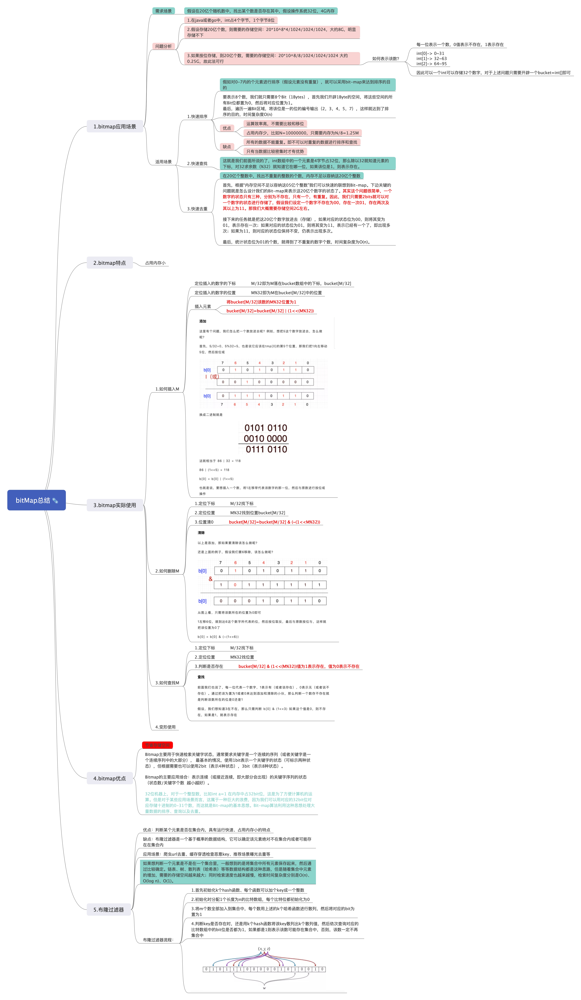
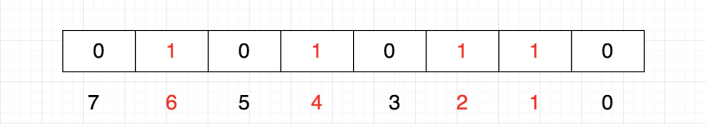
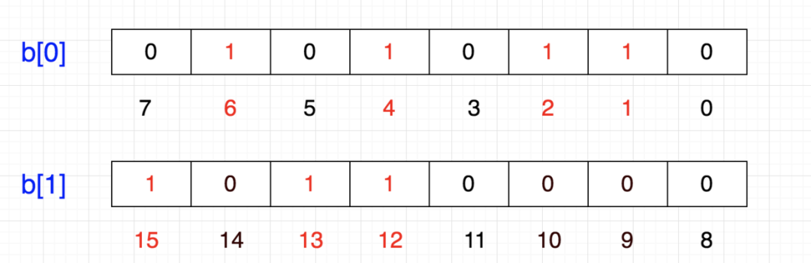
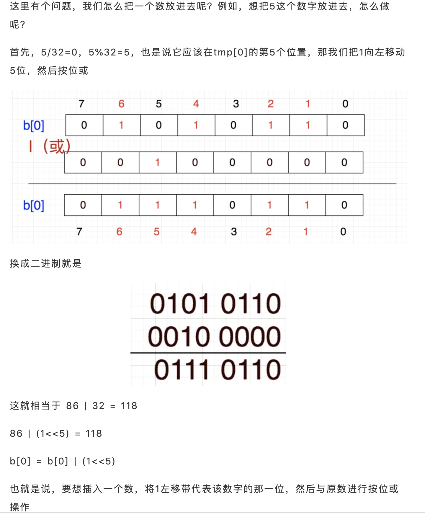
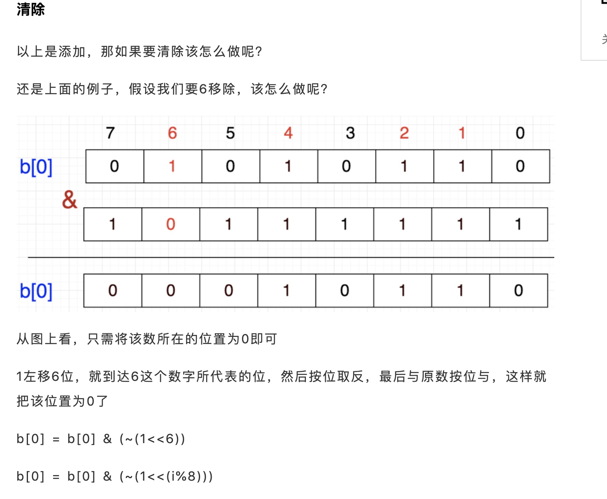

# bitmap总结



## 1.什么是bitmap？

bitmap中文翻译为**位图**，是一种简约的数据结构。它主要用计算机中的二进制中的位(bit)来描述数据的某种状态。我们通常都知道以c语言为例，在32位的操作系统上，int类型占4个字节。即我们表示一个int数字时需要4个字节的空间大小，而字节和位之间的转换关系如下：

```linux

1byte=8bit

```

总结一句话：**bitmap主要是通过用计算机中的二进制位来表示数据某种状态(是否存在、是否重复、排序等)的一种数据结构**

那这就引出一个问题来了,我好好的为什么要用二进制中的位来表示数据的状态呢？好好的一个整数就用int表示它不香吗? 下文将一点一点来进行介绍为什么我们必须要使用bitmap。


## 2.为什么要用bitmap？

前面提到了我们好端端的为什么需要用bitmap呢？这里引用一句老话**但凡存在的，就是合理的**。既然有了这种数据结构，就一定有他的价值。

在通常，数据量小的时候，我们怎么选择其实都可以。但我们现在假设这样一种场景: **需要在32位、4G的系统上，判断一个数m是否存在于20亿个不重复数组成的集合中**

我们常规的思路是，那我首先把20亿个数都用map存储下来，然后再在map中判断m是否存在，这不就可以了嘛，爽歪歪。但突然想一下，20亿个数，用int来存储的话，1个数是4byte，那20亿个数所占的空间为：20*10^8*4/1024/1024/1024(G)大约8G。我们目前的系统只够4G，看来这个需求上述思路行不通。**本质来说，是全部存储上述20亿个数据的思路行不通，我们只能另想它法。**

于是乎，我们换了一个思路，我是否可以不存储上述数据，但是又能方便的进行判断是否重复尼？思考这样一个问题，上述需求中，我们的数字只有两种状态，存在或者不存在。咦，这个好像可以用二进制中的1位就可以表示了，0表示不存在，1表示存在。那顺着这个思路后，我们就自然而言想到了，一个数我用一位来表示的话，1个字节就可以表示8个数字0~7，那20亿个数字需要空间：20*10^8/8/1024/1024/1024(G)大约为0.25G，也就是250M。这样的话，我们的计算机刚好可以实现。因此那就按照这种思路来进行实现。

基于此，我们需要解决以下几个问题：

1. 如何构造这样一个集合、多大的集合(集合容量)？
2. 如何将一个元素**插入**到该集合中？
3. 如何将一个元素从集合中**删除**？
4. 如何判断一个元素**是否存在**于集合中?

貌似又是一个增删改查的过程，哈哈。


在介绍**增删改查前**，我们对其先进行总结一下，什么样的场景下需要使用bitmap？

## 3.bitmap的应用场景

通过前文的一个例子分析我们可以得知：


**bitmap适合于但数据量、但是需求比较简单的场景**，下面结合实际的需求进行举例

**1.海量数据快速判重**
**2.海量不重复的数据进行排序**
**3.海量数据判断是否存在**


**4.用户签到**

**5.统计活跃用户（用户登陆情况）**


## 4.bitmap特点？

bitmap的特点可以从优点和缺点两个方面来说明。

**优点：**

1. **节约存储空间**
2. 性能较高 
3. 简单易实现

**缺点：**

1. 理解相对复杂一些
2. 技巧性高、了解和不了解是两种概念


## 5.bitmap实例分析

我们接着前面遗留的内容继续分析，在本节内容中，我们将主要介绍如何对前面提到的那个case进行分析和实现。

**问题：在32位、内存4G的机器上，如何判断1个数m在是否存在于20亿个不重复的整数中**    

**解决方案：通过bitmap来构造上述集合、并存储元素的状态**  

下面将详细进行介绍


### 5.1  如何确定bitmap的容量大小

对于上述20亿个数而言，需要的存储空间为250M

```shell

cap=20*10^8/8/1024/1024/1024大约0.25G、250M

```

我们先来计算下：

```shell
A[0] 有32位，可以表示0~31范围内的数  
A[1] 有32位，可以表示32~63范围内的数  
A[2] 有32位，可以表示64~95范围内的数  
........  
A[1+M/32] 有32位，可以表示32\*(1+M/32)~32\*(2+M/32)-1 

``` 

一个int类型占4个字节，所以我们需要分配250M的空间来存储上述20个亿的数据状态，通常我们会采用**开辟一段数组空间来实现**，那数组的大小为多少呢？假设数组为A，20亿个数最大的书为M，一般A的大小为**1+M/32**。因为1个int数是32位，可以表示32个数，所以要想表达20亿个数的话，只需要根据最大数M来估算即可。


### 5.2  如何插入一个数到bitmap集合中

我们先来看，假设我们需要将{1,2,4,6}插入到这样一个集合中，也就是对应的bit位设置为1，插入后的状态如下所示



如果我们将{12,13,15}插入该集合中后呢，可以看到12，13，15应该是8~15的这一段bit位，因此设置后数据如下。




其实根据上面我们可以得出结论：

**对于一个数M要将其插入到该集合中，一般分为两个步骤：**

**第一步计算该数落在的集合(int数组)中的哪个桶上，桶号可以通过M/32计算求得；**

**第二步需要计算在A[M/32]这个桶中，M这个数位于哪个bit位，由于总共有32个bit位，因此可以通过M%32来求得落在的bit位。**

通过上述，我们可以看到当计算出M位于哪个桶以及其对应的bit位数后，插入元素只需要进行如下操作即可

A[M/32] = A[M/32] | (1<<(M%32))

下面以插入5为例介绍



### 5.3  如何删除一个数从bitmap集合中

我们要删除一个元素,其实本质也是一样，需要首先定位到具体的桶，然后再将该位置设置为0即可，具体的定位桶也是M/32，定位bit为是M%32，只不过清零的逻辑是，先将1左移M%32,然后该为即为1，此时需要对齐进行按位取反，最后再和原数进行做与&操作。具体公式如下


A[M/32]=A[M/32] & (~(1<<(M%32)))  



### 5.4  如何判断一个数是否存在于bitmap集合中

其实判断是否存在逻辑也和插入、删除一样，都是先定位桶、再定位bit位。最后判断A[M/32] & (1<<M/32) 该值为0还是1。如果是1则表示存在，0表示不存在。

## 6.bitmap在redis中的应用

### 6.1 redis中的bitmap常用命令

```shell
# 设置值，其中value只能是 0 和 1
setbit key offset value

# 获取值
getbit key offset

# 获取指定范围内值为 1 的个数
# start 和 end 以字节为单位
bitcount key start end

# BitMap间的运算
# operations 位移操作符，枚举值
  AND 与运算 &
  OR 或运算 |
  XOR 异或 ^
  NOT 取反 ~
# result 计算的结果，会存储在该key中
# key1 … keyn 参与运算的key，可以有多个，空格分割，not运算只能一个key
# 当 BITOP 处理不同长度的字符串时，较短的那个字符串所缺少的部分会被看作 0。返回值是保存到 destkey 的字符串的长度（以字节byte为单位），和输入 key 中最长的字符串长度相等。
bitop [operations] [result] [key1] [keyn…]

# 返回指定key中第一次出现指定value(0/1)的位置
bitpos [key] [value]

```
在弄清 BitMap 到底占用多大的空间之前，我们再来重申下：Redis 其实只支持 5 种数据类型，并没有 BitMap 这种类型，BitMap 底层是基于 Redis 的字符串类型实现的。

我们通过下面的命令来看下 BitMap 占用的空间大小：

```shell
# 首先将偏移量是0的位置设为1
127.0.0.1:6379> setbit csx:key:1 0 1
(integer) 0
# 通过STRLEN命令，我们可以看到字符串的长度是1
127.0.0.1:6379> STRLEN csx:key:1
(integer) 1
# 将偏移量是1的位置设置为1
127.0.0.1:6379> setbit csx:key:1 1 1
(integer) 0
# 此时字符串的长度还是为1，以为一个字符串有8个比特位，不需要再开辟新的内存空间
127.0.0.1:6379> STRLEN csx:key:1
(integer) 1
# 将偏移量是8的位置设置成1
127.0.0.1:6379> setbit csx:key:1 8 1
(integer) 0
# 此时字符串的长度编程2，因为一个字节存不下9个比特位，需要再开辟一个字节的空间
127.0.0.1:6379> STRLEN csx:key:1
(integer) 2

```

通过上面的实验我们可以看出，BitMap 占用的空间，就是底层字符串占用的空间。假如 BitMap 偏移量的最大值是 OFFSET_MAX，那么它底层占用的空间就是：

(OFFSET_MAX/8)+1 = 占用字节数
因为字符串内存只能以字节分配，所以上面的单位是字节。

但是需要注意，Redis 中字符串的最大长度是 512M，所以 BitMap 的 offset 值也是有上限的，其最大值是：

8 * 1024 * 1024 * 512  =  2^32
由于 C语言中字符串的末尾都要存储一位分隔符，所以实际上 BitMap 的 offset 值上限是：

(8 * 1024 * 1024 * 512) -1  =  2^32 - 1


### 6.2 用redis实现签到功能

很多网站都提供了签到功能，并且需要展示最近一个月的签到情况，这种情况可以使用 BitMap 来实现。 根据日期 offset = （今天是一年中的第几天） % （今年的天数），key = 年份：用户id。

如果需要将用户的详细签到信息入库的话，可以考虑使用一个一步线程来完成

### 6.3 用redis统计用户活跃情况

使用日期作为 key，然后用户 id 为 offset，如果当日活跃过就设置为1。具体怎么样才算活跃这个标准大家可以自己指定。

假如 20201009 活跃用户情况是： [1，0，1，1，0] 20201010 活跃用户情况是 ：[ 1，1，0，1，0 ]

统计连续两天活跃的用户总数：

```shell
bitop and dest1 20201009 20201010 
# dest1 中值为1的offset，就是连续两天活跃用户的ID
bitcount dest1
统计20201009 ~ 20201010 活跃过的用户：

bitop or dest2 20201009 20201010

```

### 6.4 用户是否在线

如果需要提供一个查询当前用户是否在线的接口，也可以考虑使用 BitMap 。即节约空间效率又高，只需要一个 key，然后用户 id 为 offset，如果在线就设置为 1，不在线就设置为 0


## 7.bitmap相关的其他知识点

### 7.1 快速排序

假设我们需要对{1,3,5,7,4,2}这几个不重复的数进行排序，我们可以借助bitmap来实现，首先找出最大的数，然后分配bitmap空间为A[1+max/32]。然后依次遍历该列表，设置到bitmap中，最后按照bit位从小大的顺序输出对应为1的bit位即可得到有序的数据{1,2,3,4,5,7}。时间复杂度O(n)，空间极小。

**优点:**

运算效率高，不需要进行比较和移位；  
占用内存少，比如N=10000000；只需占用内存为N/8=1250000Byte=1.25M  

**缺点:**

所有的数据不能重复。即不可对重复的数据进行排序和查找。  
只有当数据比较密集时才有优势  

### 7.2 快速去重
> 20亿个整数中找出不重复的整数的个数，内存不足以容纳这20亿个整数。
> 
> 首先，根据“内存空间不足以容纳这05亿个整数”我们可以快速的联想到Bit-map。下边关键的问题就是怎么设计我们的Bit-map来表示这20亿个数字的状态了。其实这个问题很简单，**一个数字的状态只有三种，分别为不存在，只有一个，有重复**。因此，**我们只需要2bits就可以对一个数字的状态进行存储了，假设我们设定一个数字不存在为00，存在一次01，存在两次及其以上为11。那我们大概需要存储空间2G左右**。
> 
> 接下来的任务就是把这20亿个数字放进去（存储），如果对应的状态位为00，则将其变为01，表示存在一次；如果对应的状态位为01，则将其变为11，表示已经有一个了，即出现多次；如果为11，则对应的状态位保持不变，仍表示出现多次。
> 
> 最后，统计状态位为01的个数，就得到了不重复的数字个数，时间复杂度为O(n)

### 7.3 布隆过滤器

布隆过滤器总结参考[布隆过滤器总结](https://github.com/jaydenwen123/technology_articles/blob/master/202007/%E5%B8%83%E9%9A%86%E8%BF%87%E6%BB%A4%E5%99%A8%E5%8E%9F%E7%90%86.md)

## 8.参考资料

1. [Redis 中 BitMap 的使用场景](https://zhuanlan.zhihu.com/p/265016286)
2. [Bitmap的原理和应用](https://zhuanlan.zhihu.com/p/67920410)
3. [从位图到布隆过滤器](https://zhuanlan.zhihu.com/p/121585138)
4. [面试官问：BitMap了解么？在什么场景下用过？碰到过什么问题？](https://mp.weixin.qq.com/s/FTnQCbbIIezsy8gOwLFrWw)
5. [一看就懂系列之 详解redis的bitmap在亿级项目中的应用](https://blog.csdn.net/u011957758/article/details/74783347?utm_source=blogxgwz1)


