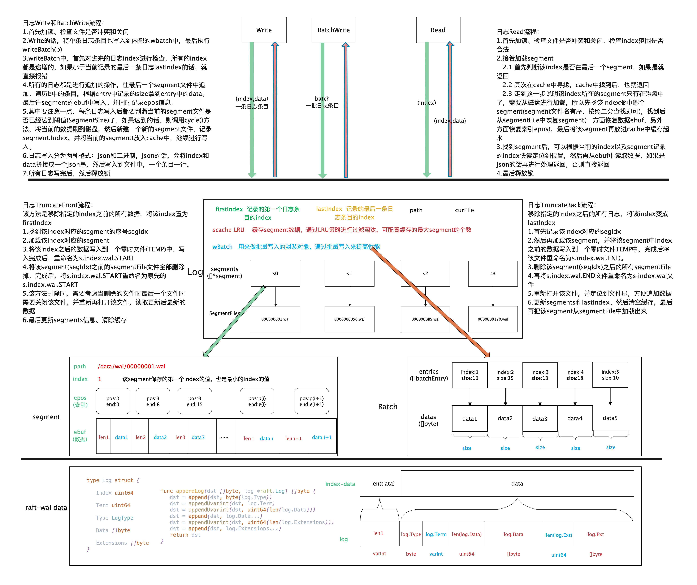

# tidwall之raft-wal源码分析

## 1. tidwall/wal模块简要介绍

在分析tidwall/raft-wal的源码前，我们先介绍一下tidwall/wal模块，raft-wal内部是采用tidwall/wal来实现的一套持久化方案

具体关于tidwall/wal的详细分析可以参考之前的[这篇文章](./tidwall之wal库源码分析.md)

## 2.tidwall/raft-wal的持久化数据存储结构



## 3.源码分析

所谓的持久化，无非就是几个接口：

* 初始化
* 写入
* 读取
* 删除

下面进行一一分析

### 3.1 核心数据结构介绍

```go
// LogStore is a write ahead Raft log
type LogStore struct {
	mu    sync.Mutex
	// wal的日志对象 
	log   *wal.Log
	buf   []byte
	batch wal.Batch
}
```

```go
// Log entries are replicated to all members of the Raft cluster
// and form the heart of the replicated state machine.
type Log struct {
	// Index holds the index of the log entry.
	Index uint64

	// Term holds the election term of the log entry.
	Term uint64

	// Type holds the type of the log entry.
	Type LogType

	// Data holds the log entry's type-specific data.
	Data []byte

	// Extensions holds an opaque byte slice of information for middleware. It
	// is up to the client of the library to properly modify this as it adds
	// layers and remove those layers when appropriate. This value is a part of
	// the log, so very large values could cause timing issues.
	//
	// N.B. It is _up to the client_ to handle upgrade paths. For instance if
	// using this with go-raftchunking, the client should ensure that all Raft
	// peers are using a version that can handle that extension before ever
	// actually triggering chunking behavior. It is sometimes sufficient to
	// ensure that non-leaders are upgraded first, then the current leader is
	// upgraded, but a leader changeover during this process could lead to
	// trouble, so gating extension behavior via some flag in the client
	// program is also a good idea.
	Extensions []byte
}
```

### 3.2 Read、Write、DeleteRange源码分析


#### 3.2.1 初始化、基础接口

```go
var _ raft.LogStore = &LogStore{}

// Options for Open
type Options struct {
	// NoSync disables fsync after writes. This is less durable and puts the
	// log at risk of data loss when there's a server crash. Default false.
	NoSync bool
}

// Open the Raft log
func Open(path string, opts *Options) (*LogStore, error) {
	s := new(LogStore)
	// 默认选项 
	wopts := *wal.DefaultOptions
	if opts != nil {
		wopts.NoSync = opts.NoSync
	}
	// opts.LogFormat = wal.JSON
	var err error
	s.log, err = wal.Open(path, &wopts)
	if err != nil {
		return nil, err
	}
	return s, nil
}

// Close the Raft log
func (s *LogStore) Close() error {
	s.mu.Lock()
	defer s.mu.Unlock()
	return s.log.Close()
}

// FirstIndex returns the first known index from the Raft log.
func (s *LogStore) FirstIndex() (uint64, error) {
	s.mu.Lock()
	defer s.mu.Unlock()
	return s.log.FirstIndex()
}

// LastIndex returns the last known index from the Raft log.
func (s *LogStore) LastIndex() (uint64, error) {
	s.mu.Lock()
	defer s.mu.Unlock()
	return s.log.LastIndex()
}
```

#### 3.2.2 Read读取日志接口
```go
// GetLog is used to retrieve a log from FastLogDB at a given index.
// 根据index读取日志 
func (s *LogStore) GetLog(index uint64, log *raft.Log) error {
	s.mu.Lock()
	defer s.mu.Unlock()
	data, err := s.log.Read(index)
	if err != nil {
		if err == wal.ErrNotFound {
			return raft.ErrLogNotFound
		}
		return err
	}
	// 设置index
	log.Index = index
	if len(data) == 0 {
		return wal.ErrCorrupt
	}
    // 日志读取解析的格式：Type+Term+len(Data)+Data+len(Ext)+Ext
	// 读取1个字节的type
	log.Type = raft.LogType(data[0])
	// 偏移data
	data = data[1:]
	var n int
	// 读取varint term
	log.Term, n = binary.Uvarint(data)
	if n <= 0 {
		return wal.ErrCorrupt
	}
	// 偏移data
	data = data[n:]
	// 读取数据长度
	size, n := binary.Uvarint(data)
	if n <= 0 {
		return wal.ErrCorrupt
	}

	// 偏移数据
	data = data[n:]
	if uint64(len(data)) < size {
		return wal.ErrCorrupt
	}
	// 读取数据
	log.Data = data[:size]
	// 偏移数据
	data = data[size:]
	// 读取扩展数据长度
	size, n = binary.Uvarint(data)
	if n <= 0 {
		return wal.ErrCorrupt
	}
	// 偏移数据
	data = data[n:]
	if uint64(len(data)) < size {
		return wal.ErrCorrupt
	}
	// 读取偏移数据内容
	log.Extensions = data[:size]
	// 偏移数据
	data = data[size:]
	if len(data) > 0 {
		return wal.ErrCorrupt
	}
	return nil
}

func appendUvarint(dst []byte, x uint64) []byte {
	var buf [10]byte
	n := binary.PutUvarint(buf[:], x)
	dst = append(dst, buf[:n]...)
	return dst
}
```

#### 3.2.3 Write写入日志接口
```go

// StoreLog is used to store a single raft log
func (s *LogStore) StoreLog(log *raft.Log) error {
	s.mu.Lock()
	defer s.mu.Unlock()
	s.buf = s.buf[:0]
	s.buf = appendLog(s.buf, log)
	return s.log.Write(log.Index, s.buf)
}

// StoreLogs is used to store a set of raft logs
func (s *LogStore) StoreLogs(logs []*raft.Log) error {
	s.mu.Lock()
	defer s.mu.Unlock()
	s.batch.Clear()
	for _, log := range logs {
		s.buf = s.buf[:0]
		s.buf = appendLog(s.buf, log)
		s.batch.Write(log.Index, s.buf)
	}
	return s.log.WriteBatch(&s.batch)
}
// 日志写入的格式：Type+Term+len(Data)+Data+len(Ext)+Ext
func appendLog(dst []byte, log *raft.Log) []byte {
	dst = append(dst, byte(log.Type))
	dst = appendUvarint(dst, log.Term)
	dst = appendUvarint(dst, uint64(len(log.Data)))
	dst = append(dst, log.Data...)
	dst = appendUvarint(dst, uint64(len(log.Extensions)))
	dst = append(dst, log.Extensions...)
	return dst
}
```


#### 3.2.4 DeleteRange删除日志接口

```go

// DeleteRange is used to delete logs within a given range inclusively.
func (s *LogStore) DeleteRange(min, max uint64) error {
	s.mu.Lock()
	defer s.mu.Unlock()
	first, err := s.log.FirstIndex()
	if err != nil {
		return err
	}
	last, err := s.log.LastIndex()
	if err != nil {
		return err
	}
	if min == first {
        // 删除包括max在内的之前的数据
		if err := s.log.TruncateFront(max + 1); err != nil {
			return err
		}
	} else if max == last {
        // 删除包括min在内之后的数据
		if err := s.log.TruncateBack(min - 1); err != nil {
			return err
		}
	} else {
		return wal.ErrOutOfRange
	}
	return nil
}

// Sync performs an fsync on the log. This is not necessary when the
// durability is set to High.
func (s *LogStore) Sync() {
	s.mu.Lock()
	defer s.mu.Unlock()
	s.log.Sync()
}

```
## 4.相关资料

* [tidwall/wal库github地址](https://github.com/tidwall/wal.git )
* [tidwall/raft-wal库github地址](https://github.com/tidwall/raft-wal.git)


