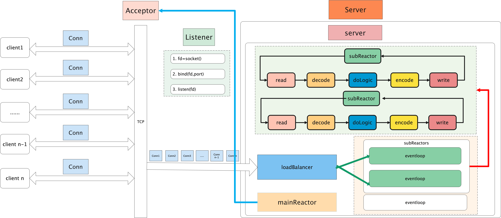
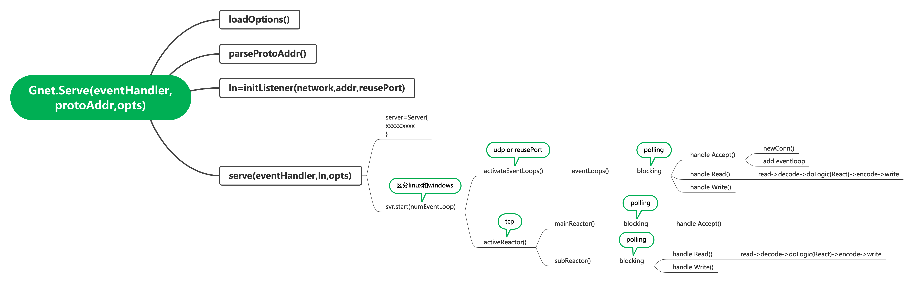
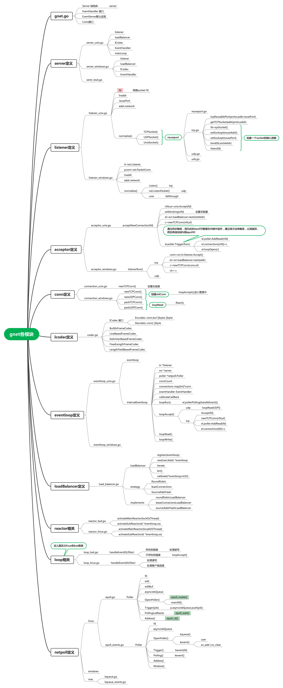

# gnet源码分析

接着上文的介绍，我们最后讨论了网络IO的几种实现模型，接下来我们有了理论基础，就可以分析一款实现reactor模型的网络框架，目前实现reactor的框架比较经典有netty、gnet。本文将重点分析gnet的网络实现。

## 1.gnet网络框架整体架构


## 2.gnet调用链分析



## 3.gnet核心模块梳理



### 3.1 gnet分析

**gnet.go**

```go
// Serve starts handling events for the specified address.
//
// Address should use a scheme prefix and be formatted
// like `tcp://192.168.0.10:9851` or `unix://socket`.
// Valid network schemes:
//  tcp   - bind to both IPv4 and IPv6
//  tcp4  - IPv4
//  tcp6  - IPv6
//  udp   - bind to both IPv4 and IPv6
//  udp4  - IPv4
//  udp6  - IPv6
//  unix  - Unix Domain Socket
//
// The "tcp" network scheme is assumed when one is not specified.
func Serve(eventHandler EventHandler, protoAddr string, opts ...Option) (err error) {
   //加载配置
	options := loadOptions(opts...)

	if options.Logger != nil {
		logging.DefaultLogger = options.Logger
	}
	defer logging.Cleanup()

	// The maximum number of operating system threads that the Go program can use is initially set to 10000,
	// which should be the maximum amount of I/O event-loops locked to OS threads users can start up.
	if options.LockOSThread && options.NumEventLoop > 10000 {
		logging.DefaultLogger.Errorf("too many event-loops under LockOSThread mode, should be less than 10,000 "+
			"while you are trying to set up %d\n", options.NumEventLoop)
		return errors.ErrTooManyEventLoopThreads
	}

 //从tcp://127.0.0.1:12解析network和addr
	network, addr := parseProtoAddr(protoAddr)

	var ln *listener
	// 初始化listener
	// 1.fd=socket()
	// 2.bind(fd,port)
	// 3.listen(fd)
	if ln, err = initListener(network, addr, options.ReusePort); err != nil {
		return
	}
	defer ln.close()
   //真正监听
	return serve(eventHandler, ln, options, protoAddr)
}

```

**listener_unix.go**

```go

type listener struct {
	once          sync.Once
	fd            int
	lnaddr        net.Addr
	reusePort     bool
	addr, network string
}3
func initListener(network, addr string, reusePort bool) (l *listener, err error) {
	l = &listener{network: network, addr: addr, reusePort: reusePort}
	err = l.normalize()
	return
}

// 归一化，选择不同的协议，进行初始化socket
// socket
// noblocking
// bind
// reusePort
// listen

func (ln *listener) normalize() (err error) {
	switch ln.network {
	case "tcp", "tcp4", "tcp6":
		ln.fd, ln.lnaddr, err = reuseport.TCPSocket(ln.network, ln.addr, ln.reusePort)
		ln.network = "tcp"
	case "udp", "udp4", "udp6":
		ln.fd, ln.lnaddr, err = reuseport.UDPSocket(ln.network, ln.addr, ln.reusePort)
		ln.network = "udp"
	case "unix":
		_ = os.RemoveAll(ln.addr)
		ln.fd, ln.lnaddr, err = reuseport.UnixSocket(ln.network, ln.addr, ln.reusePort)
	default:
		err = errors.ErrUnsupportedProtocol
	}
	if err != nil {
		return
	}

	return
}
```

### 3.2 server分析

**server_unix.go**

```go
func serve(eventHandler EventHandler, listener *listener, options *Options, protoAddr string) error {
	// Figure out the correct number of loops/goroutines to use.
	numEventLoop := 1
	if options.Multicore {
		numEventLoop = runtime.NumCPU()
	}
	if options.NumEventLoop > 0 {
		numEventLoop = options.NumEventLoop
	}

	svr := new(server)
	svr.opts = options
	svr.eventHandler = eventHandler
	svr.ln = listener

	// 选择负责均衡策略
	switch options.LB {
	case RoundRobin:
		svr.lb = new(roundRobinLoadBalancer)
	case LeastConnections:
		svr.lb = new(leastConnectionsLoadBalancer)
	case SourceAddrHash:
		svr.lb = new(sourceAddrHashLoadBalancer)
	}

	svr.cond = sync.NewCond(&sync.Mutex{})
	svr.ticktock = make(chan time.Duration, channelBuffer(1))
	svr.logger = logging.DefaultLogger
	svr.codec = func() ICodec {
		if options.Codec == nil {
			return new(BuiltInFrameCodec)
		}
		return options.Codec
	}()

	server := Server{
		svr:          svr,
		Multicore:    options.Multicore,
		Addr:         listener.lnaddr,
		NumEventLoop: numEventLoop,
		ReusePort:    options.ReusePort,
		TCPKeepAlive: options.TCPKeepAlive,
	}
	switch svr.eventHandler.OnInitComplete(server) {
	case None:
	case Shutdown:
		return nil
	}

	// 调用start，开启所有的reactor
	if err := svr.start(numEventLoop); err != nil {
		svr.closeEventLoops()
		svr.logger.Errorf("gnet server is stopping with error: %v", err)
		return err
	}
	defer svr.stop(server)

	serverFarm.Store(protoAddr, svr)

	return nil
}

func (svr *server) start(numEventLoop int) error {
	// udp或者端口重用的的话直接activateEventLoops
	if svr.opts.ReusePort || svr.ln.network == "udp" {
		// 这个里面每个actor都可以接收客户端的连接，具体在loop_bsd的handleEvent中有体现loopAccept
		return svr.activateEventLoops(numEventLoop)
	}

	return svr.activateReactors(numEventLoop)
}

```


**server_unix.go**

```go
func (svr *server) activateReactors(numEventLoop int) error {
	for i := 0; i < numEventLoop; i++ {
		if p, err := netpoll.OpenPoller(); err == nil {
			el := new(eventloop)
			// 这儿listener是同一个，没啥关系，因为其他的actor不会监听客户端连接
			el.ln = svr.ln
			el.svr = svr
			el.poller = p
			el.packet = make([]byte, 0x10000)
			el.connections = make(map[int]*conn)
			el.eventHandler = svr.eventHandler
			el.calibrateCallback = svr.lb.calibrate
			svr.lb.register(el)
		} else {
			return err
		}
	}

	// 开始所有的subReactor
	// Start sub reactors in background.
	svr.startSubReactors()

	// epoll_create()
	if p, err := netpoll.OpenPoller(); err == nil {
		el := new(eventloop)
		el.ln = svr.ln
		el.idx = -1
		el.poller = p
		el.svr = svr
		// 注册读事件，接收客户端连接
		_ = el.poller.AddRead(el.ln.fd)
		svr.mainLoop = el

		// 开始mainReactor
		// Start main reactor in background.
		svr.wg.Add(1)
		go func() {
			svr.activateMainReactor(svr.opts.LockOSThread)
			svr.wg.Done()
		}()
	} else {
		return err
	}

	return nil
}

func (svr *server) startSubReactors() {
	svr.lb.iterate(func(i int, el *eventloop) bool {
		svr.wg.Add(1)
		go func() {
			svr.activateSubReactor(el, svr.opts.LockOSThread)
			svr.wg.Done()
		}()
		return true
	})
}

```

subReactors,封装在reactor_bsd.go**

```go
func (svr *server) activateMainReactor(lockOSThread bool) {
	if lockOSThread {
		runtime.LockOSThread()
		defer runtime.UnlockOSThread()
	}

	defer svr.signalShutdown()
	// 调用epoll_wait阻塞，等待客户端连接
	err := svr.mainLoop.poller.Polling(func(fd int, filter int16) error { return svr.acceptNewConnection(fd) })
	svr.logger.Infof("Main reactor is exiting due to error: %v", err)
}


func (svr *server) activateSubReactor(el *eventloop, lockOSThread bool) {
	if lockOSThread {
		runtime.LockOSThread()
		defer runtime.UnlockOSThread()
	}

	defer func() {
		el.closeAllConns()
		if el.idx == 0 && svr.opts.Ticker {
			close(svr.ticktock)
		}
		svr.signalShutdown()
	}()

	if el.idx == 0 && svr.opts.Ticker {
		go el.loopTicker()
	}

	// 这个内部会调用epoll_wait方法，阻塞在这个地方
	err := el.poller.Polling(func(fd int, filter int16) error {
		// 取得当前的client 连接
		if c, ack := el.connections[fd]; ack {
			if filter == netpoll.EVFilterSock {
				return el.loopCloseConn(c, nil)
			}


			switch c.outboundBuffer.IsEmpty() {
			// Don't change the ordering of processing EVFILT_WRITE | EVFILT_READ | EV_ERROR/EV_EOF unless you're 100%
			// sure what you're doing!
			// Re-ordering can easily introduce bugs and bad side-effects, as I found out painfully in the past.

			// 如果写的buffer不为空，则说明有数据可写
			// 	采用kqueue的状态来判断
			case false:
				if filter == netpoll.EVFilterWrite {
					return el.loopWrite(c)
				}
				return nil
			// 	如果写的buffer为空，没有写的数据，则处理读的事件
			case true:
				if filter == netpoll.EVFilterRead {
					return el.loopRead(c)
				}
				return nil
			}
		}
		return nil
	})
	svr.logger.Infof("Event-loop(%d) is exiting normally on the signal error: %v", el.idx, err)
}

// udp和端口复用的话会走到这个
func (svr *server) activateEventLoops(numEventLoop int) (err error) {
	// Create loops locally and bind the listeners.
	for i := 0; i < numEventLoop; i++ {
		l := svr.ln
		// udp
		if i > 0 && svr.opts.ReusePort {
			// 多个listener，监听同一个地址和端口
			if l, err = initListener(svr.ln.network, svr.ln.addr, svr.ln.reusePort); err != nil {
				return
			}
		}

		var p *netpoll.Poller
		if p, err = netpoll.OpenPoller(); err == nil {
			el := new(eventloop)
			el.ln = l
			el.svr = svr
			el.poller = p
			el.packet = make([]byte, 0x10000)
			el.connections = make(map[int]*conn)
			el.eventHandler = svr.eventHandler
			el.calibrateCallback = svr.lb.calibrate
			_ = el.poller.AddRead(el.ln.fd)
			svr.lb.register(el)
		} else {
			return
		}
	}

	// Start event-loops in background.
	svr.startEventLoops()

	return
}

func (svr *server) startEventLoops() {
	// 遍历所有的subReactor，然后监听读写事件
	svr.lb.iterate(func(i int, el *eventloop) bool {
		svr.wg.Add(1)
		go func() {
			// 开始监听事件
			el.loopRun(svr.opts.LockOSThread)
			svr.wg.Done()
		}()
		return true
	})
}

// 开始event的阻塞
func (el *eventloop) loopRun(lockOSThread bool) {
	if lockOSThread {
		runtime.LockOSThread()
		defer runtime.UnlockOSThread()
	}

	defer func() {
		el.closeAllConns()
		el.ln.close()
		if el.idx == 0 && el.svr.opts.Ticker {
			close(el.svr.ticktock)
		}
		el.svr.signalShutdown()
	}()

	if el.idx == 0 && el.svr.opts.Ticker {
		go el.loopTicker()
	}

	// 阻塞在这个地方，handleEvent里面最后还调用了loopAccept
	err := el.poller.Polling(el.handleEvent)
	el.svr.logger.Infof("Event-loop(%d) is exiting due to error: %v", el.idx, err)
}
```

**激活mainReactor和

**下面的handleEvent方法是区分linux和unix分别实现的，因为linux是epoll，而mac是kqueue，读写事件的封装不同**

**loop_bsd.go**

```go
// 不仅处理客户端的读写，还处理接收客户端的请求
func (el *eventloop) handleEvent(fd int, filter int16) error {
	if c, ok := el.connections[fd]; ok {
		if filter == netpoll.EVFilterSock {
			return el.loopCloseConn(c, nil)
		}

		switch c.outboundBuffer.IsEmpty() {
		// Don't change the ordering of processing EVFILT_WRITE | EVFILT_READ | EV_ERROR/EV_EOF unless you're 100%
		// sure what you're doing!
		// Re-ordering can easily introduce bugs and bad side-effects, as I found out painfully in the past.
		case false:
			if filter == netpoll.EVFilterWrite {
				return el.loopWrite(c)
			}
			return nil
		case true:
			if filter == netpoll.EVFilterRead {
				return el.loopRead(c)
			}
			return nil
		}
	}
	// 如果连接不存在，则表示一个新的连接，因此接受的客户端的连接
	return el.loopAccept(fd)
}

```

**acceptor_unix.go**

```go
// 接收新的客户端连接
func (svr *server) acceptNewConnection(fd int) error {
	nfd, sa, err := unix.Accept(fd)
	if err != nil {
		if err == unix.EAGAIN {
			return nil
		}
		return errors.ErrAcceptSocket
	}
	// 设置非阻塞
	if err = os.NewSyscallError("fcntl nonblock", unix.SetNonblock(nfd, true)); err != nil {
		return err
	}

	netAddr := netpoll.SockaddrToTCPOrUnixAddr(sa)
	// 负载均衡，找到合适的subReactor
	el := svr.lb.next(netAddr)
	// 封装新的链接
	c := newTCPConn(nfd, el, sa, netAddr)

	// 最后将conn交给subReactor管理
	_ = el.poller.Trigger(func() (err error) {
		// 注册读事件
		if err = el.poller.AddRead(nfd); err != nil {
			return
		}
		// 添加到链接管理中
		el.connections[nfd] = c
		err = el.loopOpen(c)
		return
	})
	return nil
}
```

**connection_unix.go**

```go
// 封装新的连接
func newTCPConn(fd int, el *eventloop, sa unix.Sockaddr, remoteAddr net.Addr) (c *conn) {
	c = &conn{
		fd:             fd,
		sa:             sa,
		loop:           el,
		codec:          el.svr.codec,
		inboundBuffer:  prb.Get(),
		outboundBuffer: prb.Get(),
	}
	c.localAddr = el.ln.lnaddr
	c.remoteAddr = remoteAddr
	if el.svr.opts.TCPKeepAlive > 0 {
		// 设置长连接
		if proto := el.ln.network; proto == "tcp" || proto == "unix" {
			_ = netpoll.SetKeepAlive(fd, int(el.svr.opts.TCPKeepAlive/time.Second))
		}
	}
	return
}
```

### 3.3 poller分析

**epoll_events.go**

```go
type eventList struct {
	size   int
	events []unix.EpollEvent
}

// 事件列表
func newEventList(size int) *eventList {
	return &eventList{size, make([]unix.EpollEvent, size)}
}

// 扩容
func (el *eventList) increase() {
	el.size <<= 1
	el.events = make([]unix.EpollEvent, el.size)
}


```

**epoll.go**

```go
// Poller represents a poller which is in charge of monitoring file-descriptors.
type Poller struct {
	fd            int    // epoll fd
	wfd           int    // wake fd
	wfdBuf        []byte // wfd buffer to read packet
	asyncJobQueue internal.AsyncJobQueue
}

// OpenPoller instantiates a poller.
func OpenPoller() (poller *Poller, err error) {
	poller = new(Poller)
	// epoll_create
	if poller.fd, err = unix.EpollCreate1(unix.EPOLL_CLOEXEC); err != nil {
		poller = nil
		err = os.NewSyscallError("epoll_create1", err)
		return
	}
	if poller.wfd, err = unix.Eventfd(0, unix.EFD_NONBLOCK|unix.EFD_CLOEXEC); err != nil {
		_ = poller.Close()
		poller = nil
		err = os.NewSyscallError("eventfd", err)
		return
	}
	poller.wfdBuf = make([]byte, 8)
	//
	if err = poller.AddRead(poller.wfd); err != nil {
		_ = poller.Close()
		poller = nil
		return
	}
	poller.asyncJobQueue = internal.NewAsyncJobQueue()
	return
}

// Close closes the poller.
func (p *Poller) Close() error {
	if err := os.NewSyscallError("close", unix.Close(p.fd)); err != nil {
		return err
	}
	return os.NewSyscallError("close", unix.Close(p.wfd))
}

// Make the endianness of bytes compatible with more linux OSs under different processor-architectures,
// according to http://man7.org/linux/man-pages/man2/eventfd.2.html.
var (
	u uint64 = 1
	b        = (*(*[8]byte)(unsafe.Pointer(&u)))[:]
)

// 唤醒阻塞在网络事件上的poller
// Trigger wakes up the poller blocked in waiting for network-events and runs jobs in asyncJobQueue.
func (p *Poller) Trigger(job internal.Job) (err error) {
	if p.asyncJobQueue.Push(job) == 1 {
		_, err = unix.Write(p.wfd, b)
	}
	return os.NewSyscallError("write", err)
}

// 阻塞网络事件
// Polling blocks the current goroutine, waiting for network-events.
func (p *Poller) Polling(callback func(fd int, ev uint32) error) error {
	el := newEventList(InitEvents)
	var wakenUp bool

	for {
		n, err := unix.EpollWait(p.fd, el.events, -1)
		if err != nil && err != unix.EINTR {
			logging.DefaultLogger.Warnf("Error occurs in epoll: %v", os.NewSyscallError("epoll_wait", err))
			continue
		}

		for i := 0; i < n; i++ {
			if fd := int(el.events[i].Fd); fd != p.wfd {
				// 调用回调函数
				switch err = callback(fd, el.events[i].Events); err {
				case nil:
				case errors.ErrAcceptSocket, errors.ErrServerShutdown:
					return err
				default:
					logging.DefaultLogger.Warnf("Error occurs in event-loop: %v", err)
				}
			} else {
				wakenUp = true
				_, _ = unix.Read(p.wfd, p.wfdBuf)
			}
		}

		if wakenUp {
			wakenUp = false
			switch err = p.asyncJobQueue.ForEach(); err {
			case nil:
			case errors.ErrServerShutdown:
				return err
			default:
				logging.DefaultLogger.Warnf("Error occurs in user-defined function, %v", err)
			}
		}

		if n == el.size {
			el.increase()
		}
	}
}

const (
	readEvents      = unix.EPOLLPRI | unix.EPOLLIN
	writeEvents     = unix.EPOLLOUT
	readWriteEvents = readEvents | writeEvents
)

// AddReadWrite registers the given file-descriptor with readable and writable events to the poller.
func (p *Poller) AddReadWrite(fd int) error {
	return os.NewSyscallError("epoll_ctl add",
		unix.EpollCtl(p.fd, unix.EPOLL_CTL_ADD, fd, &unix.EpollEvent{Fd: int32(fd), Events: readWriteEvents}))
}

// AddRead registers the given file-descriptor with readable event to the poller.
func (p *Poller) AddRead(fd int) error {
	return os.NewSyscallError("epoll_ctl add",
		unix.EpollCtl(p.fd, unix.EPOLL_CTL_ADD, fd, &unix.EpollEvent{Fd: int32(fd), Events: readEvents}))
}

// AddWrite registers the given file-descriptor with writable event to the poller.
func (p *Poller) AddWrite(fd int) error {
	return os.NewSyscallError("epoll_ctl add",
		unix.EpollCtl(p.fd, unix.EPOLL_CTL_ADD, fd, &unix.EpollEvent{Fd: int32(fd), Events: writeEvents}))
}

// ModRead renews the given file-descriptor with readable event in the poller.
func (p *Poller) ModRead(fd int) error {
	return os.NewSyscallError("epoll_ctl mod",
		unix.EpollCtl(p.fd, unix.EPOLL_CTL_MOD, fd, &unix.EpollEvent{Fd: int32(fd), Events: readEvents}))
}

// ModReadWrite renews the given file-descriptor with readable and writable events in the poller.
func (p *Poller) ModReadWrite(fd int) error {
	return os.NewSyscallError("epoll_ctl mod",
		unix.EpollCtl(p.fd, unix.EPOLL_CTL_MOD, fd, &unix.EpollEvent{Fd: int32(fd), Events: readWriteEvents}))
}

// Delete removes the given file-descriptor from the poller.
func (p *Poller) Delete(fd int) error {
	return os.NewSyscallError("epoll_ctl del", unix.EpollCtl(p.fd, unix.EPOLL_CTL_DEL, fd, nil))
}
```

### 3.4 loadBalancer分析

**load_balancer.go**

```go
// loadBalancer is a interface which manipulates the event-loop set.
	loadBalancer interface {
		register(*eventloop)
		next(net.Addr) *eventloop
		iterate(func(int, *eventloop) bool)
		len() int
		calibrate(*eventloop, int32)
	}

	// roundRobinLoadBalancer with Round-Robin algorithm.
	// 轮询算法
	roundRobinLoadBalancer struct {
		nextLoopIndex int
		eventLoops    []*eventloop
		size          int
	}

	// leastConnectionsLoadBalancer with Least-Connections algorithm.
	// 最小连接算法
	leastConnectionsLoadBalancer struct {
		sync.RWMutex
		minHeap                 minEventLoopHeap
		cachedRoot              *eventloop
		threshold               int32
		calibrateConnsThreshold int32
	}

	// sourceAddrHashLoadBalancer with Hash algorithm.
	// 源地址hash
	sourceAddrHashLoadBalancer struct {
		eventLoops []*eventloop
		size       int
	}
```


## 4.gnet源码分析


## 5.gnet源码注释

[http://github.com/jaydenwen123/gnet](https://github.com/jaydenwen123/gnet/tree/jaydenwen123_comment)
